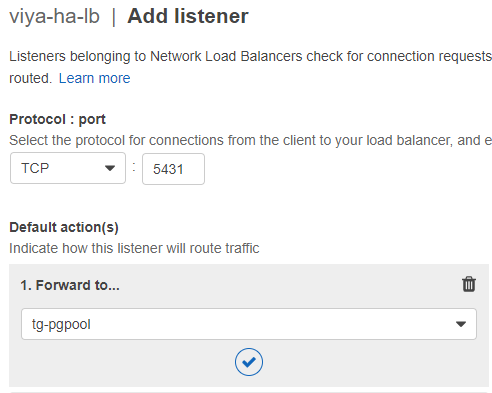

# Enabling High Availability for SAS Viya 3.5 in an Amazon Web Services (AWS) Environment

High availability (HA) is supported for SAS Viya deployments in Cloud
infrastructures. A clustered PGPool configuration, one of the mandatory
preconditions for HA SAS Viya deployments, typically requires a virtual IP
address. In Public Cloud environments, this network component is not available,
necessitating some additional configuration to work around this limitation. For
more information, see
[Using Elastic IP Addresses in Amazon EC2](https://docs.aws.amazon.com/sdk-for-java/v1/developer-guide/examples-ec2-elastic-ip.html).

Starting with SAS Viya 3.5, HA is supported in Public Cloud environments with
some additional configuration. (It is not supported in earlier versions of SAS
Viya.) Use the examples in this document to prepare your Public Cloud
environment for a highly available deployment of SAS Viya 3.5.

The requirements to support a full HA deployment of SAS Viya 3.5 in a Public
Cloud, such as Amazon Web Services (AWS), include the following:

- a component that can replace the virtual IP address that is required for
  highly available PostgreSQL (HA PGPool).

  In this document, the replacement component with which we have tested is a
  network load balancer.

- an HTTPS application load balancer or gateway
- a shared file system

## Example Environment

Our test bed included the following components:

- 2 backend hosts running SAS Viya microservices and infrastructure servers
- 5 backend hosts for CAS (2 controllers and 3 workers)
- 3 backend hosts running SAS Infrastructure Data Server (PGPool and PostgreSQL)
- a network load balancer with a public IP address, which redirects incoming
  connections on the PGPool port to a backend pool that includes the PGPool
  hosts
- a shared file system
- an application load balancer
- a front-end jump server with a public IP address, which is used for login and
  acts as the Ansible controller.

A highly available deployment of SAS Viya requires redundant instances of key
components, chiefly the CAS server and SAS Infrastructure Data Server. The
distributed CAS server consists of one or more controller nodes (primary and
secondary) and two or more worker nodes.

HA SAS Infrastructure Data Server is a clustered PostgreSQL database containing
at least one PGPool instance and at least one data node. A SAS Infrastructure
Data Server cluster consists of three or more PGPool nodes (the pgpoolc host
group) and two or more PostgreSQL data nodes (the sasdatasvrc host group). It is
possible to colocate PGPool and the data nodes, but a minimum of three PGPool
instances is required.

You can use more machines or dedicated hosts for the CAS server and PGPool
cluster, but our test bed corresponds to the minimum footprint and requirement
to have a full HA environment (where the environment will continue to work even
in the event of a machine failure).

_**IMPORTANT:**_  If your SAS Viya software order included products that
use SAS Common Planning Service, additional resources will be required. These
products include SAS Assortment Planning, SAS Demand Planning, SAS Financial
Planning, and SAS Markdown Optimization. For more information, see
[Additional Setup for CPSPGPool](#additional-setup-for-cpspgpool).

## Overview of Steps

[[_TOC_]]

## Setting Up HA SAS Viya on AWS

Public Cloud on AWS has unique characteristics that we do not attempt to predict
in this document. Instead, we provide an example in order to illustrate the
required components. Generally, we did not test optional AWS configurations.

Use the AWS Management Console or your preferred command-line tool to perform
steps similar to the ones that we have documented in this example. In this
document, we describe the steps you can take in the AWS Management Console.

> _**IMPORTANT:**_ In this example, we assume that your AWS deployment already
> has at least one region and within that region, _at least two_ availability
> zones.

_**NOTE:**_ The steps and screen captures in this document were current as of
December 2020.

## Create a Dedicated Virtual Private Cloud (VPC)

Create a VPC for your highly available SAS Viya deployment.

1. Log in to the AWS Management Console. In the **Find Services** field, type
   `VPC` and select it from the search results.

1. In the **VPCs** pane, select your **Region** from the menu.

   

1. On the Your VPCs page, click **Create VPC**.
1. On the Create VPC page, specify values for the following options:

   - For **Name tag**, specify a name for the VPC that will help you identify
     it.
   - For **IPv4 CIDR block**, specify an IP address and subnet mask for your
     VPC, such as `10.17.0.0/22`.
   - Leave the default settings for **IPv6** and **Tenancy**.

   

1. In the **Tags** section, add new tags if desired.
1. Click **Create VPC**.

### Create Dedicated Subnets

Create at least two subnets for your HA SAS Viya deployment.

1. Return to the Resources by Region view on the VPC Dashboard, and click
   **Subnets**.
1. Above the list of subnets in your region, click **Create subnet**.
1. On the Create subnet page, specify a **Name tag** for the subnet.
1. Select the VPC that you created previously from the **VPC** menu.
1. From the **Availability Zone** menu, select an availability zone within your
   region.
1. For the **IPv4 CIDR block**, specify an IP address and subnet mask for the
   subnet. The address must fall within the CIDR block associated with the VPC.
   For example, specify `10.17.1.0/24`.

   

1. Click **Create**.
1. Repeat the previous steps to create at least one additional subnet, with a
   different availability zone and a different IPv4 CIDR block.

## Create VM Instances

Create the VM instances that you need for a highly available SAS Viya
deployment. Our test bed included two VM instances that were deployTargets for
the SAS Viya services and infrastructure servers, five VM instances for the CAS
server, and three additional instances for PGPool. Place only PGPool VM
instances in one of the subnets that you created previously so that you can
create firewall rules that apply only to PGPool.

1. Navigate to the EC2 console dashboard. In the Instances section in the left
   pane, click **Instances**.
1. Click **Launch Instances**. A wizard page opens at Step 1: Choose an Amazon
   Machine Image (AMI).
1. Select an image type that includes Red Hat Enterprise Linux 7. (Red Hat
   Enterprise Linux 8 is not supported.) Search for it in the Amazon Marketplace
   if necessary.

1. Verify your selection, and click **Continue**.
1. On the Step 2: Choose an Instance Type page, select an **Instance type**. SAS
   recommends:

   - At least an r5.4xlarge EC2 instance type.
   - At least 8 VCPUs
   - At least 64 GB of memory

1. Click **Next: Configure Instance Details**.
1. On the Configure Instance Details page, specify values for the following
   options:

   - **Number of instances**: Specify the number of VM instances that you want
     to create with the same settings. You can create all instances with the
     same settings if desired. However, you might want to allocate additional
     RAM and CPU to instances that will host the CAS server.

     Do not select the option to **Launch into Auto-Scaling Group**.

   - **Purchasing option**: Leave the option to **Request Spot instances**
     unchecked (the default).
   - **Network**: Select the VPC that you created previously.
   - **Subnet**: Select one of the subnets that you created previously.

     > _**NOTE:**_ To conform to AWS best practices and ensure failover
     > capabilities, do not place all VM instances in the same subnet. Having VM
     > instances distributed between at least two subnets enables you to
     > [configure an application load balancer](#create-an-application-load-balancer-for-the-apache-http-server)
     > later, which requires multiple availability zones and their associated
     > subnets. In addition, dedicating a subnet to your PGPool VM instances
     > enables you to apply different firewall rules to these instances, the
     > only VM instances in your deployment that require public elastic IP
     > addresses.

   - **Auto-assign Public IP**: Leave this option disabled (the default).

   Multiple instance settings are optional. Here are recommended selections:

   - **Placement Group**: Leave the check box unchecked (the default).
   - **Capacity Reservation**: Select **None**.
   - **Domain join directory**: Select a directory if desired. However, SAS did
     not test with Domain join enabled.
   - **IAM role**: If you are running with Domain join enabled, specify the
     corresponding IAM role.
   - **CPU Options**: Select the check box to add CPU cores or VCPUs. Consult
     the
     [SAS Viya System Requirements](http://documentation.sas.com/?cdcId=calcdc&cdcVersion=3.5&docsetId=dplyml0phy0lax&docsetTarget=n0iuh6029au7ton136yfzp33z9q3.htm&locale=en#n1xvr2ble7twxjn172cvwn7hqmnd)
     for guidance. Your product license specifies the number of CPU cores.
   - **Shutdown behavior**: Select either **Stop** or **Terminate** as the
     preferred handling of the instance if an operating-system failure occurs.
   - **Stop - Hibernate behavior**: Leave the check box unchecked (the default).
   - **Enable termination protection**: Leave the check box unchecked (the
     default).
   - **Monitoring**: Select the check box for **Enable CloudWatch detailed
     monitoring** if desired.
   - **Tenancy**: Select one of the dedicated hardware options if desired.
   - **Elastic inference**: Select the check box for **Add an Elastic Inference
     accelerator** if desired.

### Add a File System to the VM Instances

The Configure instance details page includes an option to add a file system. VM
instances that are targets for the [ComputeServer] host group will need a shared
file system for SAS Studio. Instances that are targets for the
[sas_casserver_primary] host group need a shared file system for caslibs.

1. Still on the Configure instance details page, locate the **File Systems**
   section.
1. Click **Add file system**.
1. Select a file system from the menu if you already have file systems
   configured for your enterprise. Otherwise, click **Create new file system**.
1. Mount the new file system at `/opt/sas`.

   

1. Create and mount file shares for the
   [required shared Home directory](https://documentation.sas.com/?docsetId=dplyml0phy0lax&docsetTarget=n0iuh6029au7ton136yfzp33z9q3.htm&docsetVersion=3.5&locale=en#n1ic1yydp46vxun1bhhii6rnyg2x)
   on all SAS Viya VM instances that will host the [ComputeServer] host group.

   > **_NOTE_**: When you configure a jump server host, that VM instance also
   > needs this file share mount if you installed a default OpenLDAP server
   > there.

1. Create and mount file shares for the CAS server as described in
   [Enable a Shared File System](https://go.documentation.sas.com/?cdcId=calcdc&cdcVersion=3.5&docsetId=dplyml0phy0lax&docsetTarget=n10k0xp8qud9mkn1l8mhl992ikyg.htm&locale=en#p1u5hdmssc4y87n1ltl5wl8ews6g).
   VM instances that host the CAS server need a file share mounted at
   `/opt/sas/viya/config/data/cas`.

1. Leave the default settings in the **Network interfaces** and **Advanced
   Details** sections of the Configure Instance Details page.

1. Click **Next: Add Storage**.

### Add Storage to the VM Instances

The VM instances that will host CAS server components require a shared file
system on a persistent storage volume.

SAS recommends that you use a volume that is HA-enabled. For example, the disks
where files are stored should not have a single point of failure.

1. Add a storage volume to store log files. Still on the Add Storage page of the
   Launch Instance wizard, click **Add New Volume**.

1. Select **Type**, **Device Name**, and **Snapshot** options as desired.
   Consult the "File System and Storage Options" section of the
   [SAS Viya System Requirements](http://documentation.sas.com/?cdcId=calcdc&cdcVersion=3.5&docsetId=dplyml0phy0lax&docsetTarget=n0iuh6029au7ton136yfzp33z9q3.htm&locale=en#p102lmyplck0een1n8n27chqpstf)
   for guidance, and add additional volumes as required.
1. Click **Add Tags** if you want to tag your VM instances. Otherwise, click the
   **Configure Security Group** tab to skip to that page.

### Modify the Security Group and Launch VM Instances

The default security group that is associated with new VM instances in AWS
provides rules to enable external traffic to reach your instances through the
SSH and HTTP ports.

If you already have a security group configured for other VM instances in your
AWS environment, you can apply it to these VM instances. Click the button
labeled **Select an existing security group**, and select it from the menu.

Otherwise, add only minimal rules to secure the VM instances at this time. We
will create full-featured security groups for the subnets in your VPC
[as a separate step](#create-security-groups).

1. Click **Create a new security group**.
1. Specify a **Name** for the group.
1. Specify a **Description** to help you identify the firewall settings in this
   security group.
1. The default security group includes default rules that allow traffic from any
   IP address to reach your VM instances through the SSH and HTTP ports. Modify
   the default rules to add security. Click **Add Rule** to add additional
   rules, if desired.

   For each rule:

   - Select **Custom** for the **Source**

   - Replace the "all traffic" IP address with the IP address and subnet mask
     that you configured for your VPC.
   - Add a **Description** for each rule, if desired.

1. When you are satisfied with your firewall rules, click **Review and Launch**.
1. Review your selections and click **Launch**.
1. In the Select an existing key or create a new key pair dialog box that
   appears, select an option from the menu.

   - If you want to create a new key pair, specify a **Name** for the key pair.
     Then click **Download Key Pair** to obtain a new SSH key pair from Amazon.
     Save the PEM file to your local machine.

   - Otherwise, select **Choose an existing key pair** and select the PEM file
     from the menu.

   > _**NOTE:**_ A key pair is required to enable SSH access to your VM instance
   > during the SAS Viya deployment.

1. Select the check box labeled **I acknowledge that I have access to the
   selected private key file** or the equivalent for the option you selected,
   and click **Launch Instances**.

## Create Elastic IP Addresses

Create elastic IP addresses (static IP addresses) and associate them with the VM
instances that you created previously. Create an additional elastic IP address
for the load balancer.

The VM instances that will host PGPool components require external (public) IP
addresses. All other VM instances can have internal (private) IP addresses. In
this example, we first create the IP addresses for PGPool VM instances.

1. Return to the EC2 console dashboard. In the Network & Security section in the
   left pane, click **Elastic IPs**.
1. The Elastic IP addresses page lists any elastic IP addresses that you have
   created for another purpose. Click **Allocate Elastic IP address**.
1. On the Allocate Elastic IP address page, select settings for the following
   options:

   - **Network Border Group**: This setting by default restricts the IP address
     to the zones in your Network Border Group, which corresponds to your
     region. Use the default setting.
   - **Public IPv4 address pool**: Select **Amazon's pool of IPv4 addresses**
     unless you already have address pools that you want to use.
   - **Global static IP addresses**: SAS did not test with the option to
     **Create accelerator** selected.

1. Click **Allocate**.
1. You return to the Elastic IP addresses page. The new IP address appears in
   the list. Click the link to the address to select it.
1. Above the Summary information about the IP address, click the **Associate
   Elastic IP address** button.
1. The default Resource Type is **Instance**. Click to activate the **Instance**
   menu, and select a VM instance from your set of PGPool targets.
1. Do not select a **Private IP address** for this elastic IP address.

   > _**NOTE:**_ The VM instances that will host PGPool require a public
   > (external) IP address in order for the network load balancer to communicate
   > with them.

1. Click **Associate**.

1. Repeat the previous steps until you have assigned an elastic public IP
   address to all the VM instances that will host PGPool.

   You will add these VM instances to the target group for the network load
   balancer.

1. Repeat the steps again, but select the **Private IP address** option for all
   VM instances that host other SAS Viya components (and not PGPool).

   VM instances that do not host PGPool will not be members of the target group
   for the network load balancer.

1. Create one elastic public IP address that you can later allocate to the
   network load balancer. We will
   [create it as a separate step](#create-a-network-load-balancer). Like the IP
   addresses for PGPool instances, this final IP address cannot be private.

## Create Security Groups

Create a set of firewall rules to allow inbound traffic to reach the VM
instances in each subnet CIDR range that you created previously. The rules for
each subnet are slightly different, so plan to create at least two security
groups.

You will need to add rules that open the ports that are used by the PGPool VM
instances and that enable the elastic IP address that you allocated to your jump
server host to contact the VM instances.

One security group is intended to secure the subnet that is dedicated to the VM
instances that will _not_ host PGPool components. These instances should include
CAS server hosts. That security group requires firewall rules that specify the
following:

- allow internal communications among all VM instances that are within the
  subnet IP address range (all ports, all protocols)
- allow incoming SSH traffic from the jump server to access VM instances
  (port 22)
- allow incoming TCP traffic for SAS Viya Backup Service (port 7)
- allow outgoing traffic from all hosts in the subnet using HTTPS (port 443)

The first firewall rule listed here is the most important. Be sure to apply it
to all targets in the selected subnet.

The second security group is intended to secure the subnet that is dedicated to
PGPool VM instances. The rules for PGPool hosts are slightly different because
these hosts require public elastic IP addresses. This group requires firewall
rules that specify the following:

- allow internal TCP communications among all VM instances that are within the
  subnet IP address range (all ports, all protocols)
- allow incoming HTTPS traffic from hosts that are external to the subnet where
  the VM instances are running (port 443)
- allow incoming TCP traffic on the PGPool port (5431 by default) and PCP port
  (5430 by default)
- allow incoming TCP traffic for SAS Viya Backup Service (port 7)

Take steps that resemble the following to create a security group for each
subnet where SAS Viya will be deployed:

1. Return to the EC2 console dashboard. In the Network & Security section in the
   left pane, click **Security Groups**.
1. Above the list of security groups in your region, click **Create security
   group**.
1. On the Create security group page, specify a **Security group name** to
   identify it.

   In this example, we would name the first group something like
   `non-pgpool-hosts` and the second group `pgpool hosts`.

1. Specify a **Description** of the group.
1. Select your VPC from the **VPC** menu.
1. Scroll down to the **Inbound Rules** section.
1. Modify the default rule that is displayed, as follows:

   - For the **Type**, select **Custom TCP**.
   - For the **Port Range**, specify **0–65535** to allow access on all ports.
   - For the **Source** parameter, select **Custom**. Then replace the "all
     traffic" IP address with the IP address and subnet mask that you configured
     for your VPC.
   - Specify a **Description** if desired.

1. Click **Add Rule** and select settings to add the remaining required rules
   that are described above.
1. By default, the security group includes an outbound rule to allow all
   outbound traffic from your VM instances. Scroll down to the **Outbound
   Rules** section.
1. Modify the default rule that is displayed, as follows:

   - For the **Protocol** and **Port Range**, click to select **Allow all**.
   - For the **Destination** parameter, select **Custom**. Then replace the "all
     traffic" IP address with the IP address and subnet mask that you configured
     for your VPC.
   - Specify a **Description** if desired.

   When completed, your firewall rules will resemble the following:

   

1. Click **Create security group**.

## Create Target Groups

Target groups are required to enable the load balancer to route traffic to your
SAS Viya VM instances. These groups will also enable health checks that alert
you to problems with your SAS Viya deployment in AWS.

Create target groups:

- for the PGPool port (5431)
- for the PCP port (5430)
- for the backup plug-in to the sas-admin CLI (port 7)
- for the VM instances that will host SAS Viya services and Apache httpd
  (port 443)

1. Return to the EC2 console dashboard. In the Load Balancing section in the
   left pane, click **Target Groups**.
1. On the Target groups page, click **Create target group**.
1. On the Specify group details page, select **Instances** as the Target type.
1. Specify a **Name** for your target group to help you identify its membership.
   For example, we created target groups named `tg-pgpool`, `tg-pcp`,
   `tg-backup`, and `tg-httpd`.

   Specify values for the following options:

   - **Protocol**: Select **TCP**.
   - **Port**: Specify **5431** for the target group that contains PGPool VM
     instances (`tg-pgpool`), **5430** for the target group that contains PCP
     instances (`tg-pcp`), **7** for the target group that contains instances
     where the sas-admin CLI components will be deployed (`tg-backup`), and
     **443** for the target group that contains instances where the httpd
     component will be deployed (`tg-httpd`).
   - **VPC**: Select the dedicated virtual private cloud that you created
     previously.

     

1. Configure a PGPool health check. In the Health checks section, select
   **HTTP** for the **Health check protocol**.
1. For the **Health check path**, leave the default setting.
1. Click to expand the **Advanced health check settings** section.
1. For the Port, select **Override**, and specify `5431`.

   > _**NOTE:**_ Be sure to use the PGPool port for the health check; if you use
   > the PCP port instead, `pcp_read` errors are listed in pgpool.log.
   > Additional health checks are not required for your additional target
   > groups.

1. Change the following default settings if desired:

   - **Healthy threshold**: The default is 3 check successes to indicate that
     the target is healthy
   - **Unhealthy threshold**: The default is 3 check failures to indicate that
     the target is unhealthy

     

   - **Timeout**: The default is 6 seconds before the health check times out
     without receiving a response from the target
   - **Interval**: The default is 30 seconds between health checks
   - **Success code**: Refers to the HTTP code that indicates that the target
     was successfully contacted

1. Add **Tags** if desired. Then click **Next**.
1. The Register targets page shows a list of VM instances. Select at least three
   VM instances for the PGPool target group, scroll down, and click **Include as
   pending below**.
1. When the instances are showing in the list of Targets, verify that you have
   selected the VM instances that you want. Then click **Create target group**.

The new target group appears in the list on the Target groups page.

Repeat the previous steps to create target groups for PCP VM instances and for
the instances that will host SAS Viya services (the sas-admin CLI backup plug-in
and the Apache httpd component).

## Create a Network Load Balancer

Create a Network Load Balancer for your HA SAS Viya deployment. The load
balancer is internal to your VPC network. It takes the place of the virtual IP
address that is required to support high availability for PGPool instances.

1. Return to the EC2 console dashboard. In the Load Balancing section in the
   left pane, click **Load Balancers**.
1. Above the list of load balancers in your region, click **Create Load
   Balancer**.
1. On the Select load balancer type page, select **Network Load Balancer** and
   click **Create**.
1. Specify values for the following options:
   - **Name**: Specify a name for the load balancer to help you identify it.
   - **Scheme**: Select **internet-facing**.
1. In the Listeners section, select either **TCP** or **TLS** for the
   **Listeners Protocol**, depending on the security requirements of your
   organization.
1. For the Load Balancer port, specify the PGPool port (5431).
1. In the Availability Zones section, select the dedicated **VPC** that you
   created previously.
1. For Availability Zones, select the **Availability Zone** where the target
   instances for PGPool are running.
1. Click the menu to enable it, and select its associated **Subnet**.
1. For **IPv4 address**, select **Choose Elastic IP**. Select the elastic IP
   address that you created previously for the load balancer.

   

   > **_NOTE:_** This IP address will be used as the value for > the
   > HA_PGPOOL_VIRTUAL_IP variable in the SAS Viya deployment playbook. Record
   > it.

1. Add Tags if desired. Click **Next: Configure Security Settings**.

   You might see a warning that states,
   `Your load balancer is not using any secure listener.` You can probably
   ignore the warning. However, if your enterprise requires it, edit the load
   balancer configuration to use **TLS** as the **Protocol** for the listener.

1. Click **Next: Configure Routing**.

### Add Target Groups to the Load Balancer

Add listener ports for the load balancer to your target groups (previously, we
used the names `tg-pgpool`, `tg-pcp`, and `tg-backup` for our target groups). Do
not add the port for the `tg-httpd` group.

1. Still in load balancer configuration, you have reached the Step 3: Configure
   routing page. Click the **Target Group** menu to enable it, and select
   **Existing target group**.

1. Select the `tg-pgpool` target group that you created previously.
1. Click **Register Targets**. Your target group should already show your
   registered targets in the list.
1. Click **Next: Review**.
1. Click **Create**.
1. Locate the link to the new load balancer in the Suggested Next Steps section
   of the Success message page, and click it to navigate to the load balancer.
1. In the lower section of the Load Balancers page, click the **Listeners** tab
   to add additional listener ports (you might need to drag the horizontal
   divider to increase the size of the lower pane). The listener for PGPool port
   (5431) is already listed because of the target group that you selected.

1. Click **Add listener** to add listener services for the PCP port (5430) and
   backup port (7). Select values for the following options:

   - Protocol: **TCP**
   - Port: The PCP port (`5430`) and the backup port (`7`), one per listener

1. Click **+ Add action**.
1. Select **Forward to...** and select `tg-pcp` or `tg-backup`, depending on
   which one you are setting up.
1. Click the check-mark button to save the new listener service.

   

1. Click the **Save** button near the top of the page when you have added an
   action to each listener.

1. Repeat the previous steps until you have listeners for three target groups.
   We will configure the `tg-httpd` target group later.

When you have added listeners for the PCP port and backup port, verify that the
listener ports match the target groups in the list of Listeners.

> _**NOTE:**_ If CPSPGPool for SAS Common Planning Service is also being set up,
> the CPSPGPool component needs its own target groups and load balancer. You
> can, however, install CPSPGPool on the same VM instances where you install
> PGPool.You will also need to configure a security group to allow the ports
> that are used by CPSPGPool.

## Create an Application Load Balancer for the Apache HTTP Server

Set up an application load balancer for the SAS Viya reverse proxy server.
Apache httpd supports the Apache HTTP server. The httpd component will be
deployed automatically on the VM instances that we designate as targets for the
HTTP proxy installation.

> _**NOTE:**_ In this example, we use the AWS Certificate Manager to generate
> and manage certificates. You can also use generate and configure your own
> custom certificates that comply with the security policies at your enterprise.

### Configure and Secure the Application Load Balancer

Set up the load balancer and generate the certificates. You can perform these
steps on the jump server so that you can easily distribute certificates.

1. Return to the EC2 console dashboard. In the Load Balancing section in the
   left pane, click **Load Balancers**.
1. Above the list of load balancers in your region, click **Create Load
   Balancer**.
1. On the Select load balancer type page, select **Application Load Balancer**
   and click **Create**.
1. Specify values for the following options:

   - **Name**: Specify a name for the load balancer to help you identify it.
   - **Scheme**: Select **internet-facing**.
   - **IP address type**: IPv4 or IPv6

1. In the Listeners section, select **HTTPS** for the **Listeners Protocol**.
   

1. In the Availability Zones section, select the dedicated **VPC** that you
   created previously.
1. For **Availability Zones**, click to select one of the availability zones
   that you associated with the target VM instances.
1. Click to select a **Subnet** for the selected availability zone.
1. Repeat the steps to select all of the availability zones and subnets that you
   created for your cluster.
1. Enable Add-on Services, such as a Global Accelerator, and tags, if desired.
   In our testing, we did not configure add-on services or tags.
1. Click **Next: Configure Security Settings**.
1. You are prompted to **Select a default certificate**. Select an option for
   securing the application load balancer with a certificate. SAS recommends
   using the default option, **Choose a certificate from ACM (recommended)**.
1. Click the link labeled **Request a new certificate from ACM**. The AWS
   Certificate Manager (ACM) opens in a new browser tab.
1. In the **Domain name** field, specify the fully qualified domain name of the
   site where the SAS Viya deployment will be running.
1. Add another name if desired, and click **Next**.
1. Select the **Validation method** for ACM to use to validate your certificate,
   and click **Next**.
1. Add tags to your certificate if desired, and click **Review**.
1. Review your selections and click **Confirm and request** to complete
   certificate setup. A certificate request is created and sent for validation.
1. Return to the browser tab that displays the Configure security settings page.
1. Select the new certificate from the **Certificate name** menu.
1. Use the default **Security policy**, or select a different policy from the
   list.
1. Click **Next: Configure security groups**.
1. Select the option to **Create a new security group**.
1. Specify a **Name** for the security group.
1. Create a security rule. Modify the default rule that is displayed, as
   follows:

   - From the **Type** menu, select **HTTPS**.
   - For the **Source** parameter, select **Anywhere**.

   

1. Click **Add rule**.
1. Click **Next: Configure Routing**.
1. For **Target group**, select **Existing target group**. From the menu, select
   the `tg-httpd` target group that you created previously, in
   [Create Target Groups](#create-target-groups).
1. Specify values for the following options:

   - **Name**: Specify a name for the target group to help you identify it.
   - **Target type**: Select **Instance**
   - **Protocol**: Specify **HTTPS**.
   - **Protocol Version**: Leave the default at **HTTP1**.

   

1. Configure an httpd health check. In the Health checks section, select
   **HTTPS** for the **Health check protocol**.
1. For the **Health check path**, leave the default setting.
1. Click **Next: Register Targets**.
1. The Register targets page shows a list of VM instances in the availability
   zone that you selected previously. Select at least two VM instances for the
   httpd target group, scroll down, and click **Include as pending below**.
1. When the instances are showing in the list of Targets, verify that you have
   selected the VM instances that you want. Then click **Create target group**.

   The new target group appears in the list on the Target groups page.

1. Click **Next: Review**.
1. Click **Create** to create the application load balancer.

## Configure the DNS Name of the Elastic IP Address

In order to enable the backup plug-in to the sas-admin CLI on AWS, the DNS name
of the elastic IP address for the network load balancer must be included in the
PGPool certificate (if SSL is enabled, which is the default). To add the DNS
name to the certificate, the network binding for `SAS_SAN_DNS` must be set using
network configuration files. For a full set of instructions, see
[Specify Network Settings](http://pubshelpcenter.unx.sas.com:8080/test/?cdcId=calcdc&cdcVersion=3.5&docsetId=dplyml0phy0lax&docsetTarget=n11nt9q5r1i9mun1e7m2chgxgyii.htm&locale=en#p0e2al4eop630cn1jfr3fn55tcsa)
in the _SAS Viya 3.5 Deployment Guide_.

1. In the Ansible playbook directory, create a directory named `host_vars/`:

   ```unix
   cd /sas/ansible/sas_viya_playbook
   mkdir host_vars
   ```

1. Under the `host_vars/` directory, create a _deployTarget_.yml file for each
   PGPool host. For example, create `pgpool0-host.yml`, `pgpool1-host.yml`, and
   `pgpool2-host.yml`.

   These files must contain the complete list of the host names in the cluster,
   such as the FQDN of the PGPool host, its short host name, and `localhost`. In
   addition, they must include the FQDN of the load balancer's elastic IP
   address. You can run `hostname -f` to obtain the FQDN and `hostname -s` to
   obtain the short host name. The elastic IP address can be obtained from the
   Elastic IPs list in the AWS EC2 console.

For example, when the host names are as follows:

```txt
pgpool0-host: ip-10-0-141-100.ec2.internal
pgpool1-host: ip-10-0-141-111.ec2.internal
pgpool2-host: ip-10-0-141-123.ec2.internal
EIP DNS: ec2-52-7-100-200.compute-1.amazonaws.com
```

the YML files would resemble the following examples:

```yaml
network_conf:
  SAS_SAN_DNS:
    "ip-10-0-141-100.ec2.internal ip-10-0-141-100 localhost
    ec2-52-7-100-200.compute-1.amazonaws.com"
---
network_conf:
  SAS_SAN_DNS:
    "ip-10-0-141-111.ec2.internal ip-10-0-141-111 localhost
    ec2-52-7-100-200.compute-1.amazonaws.com"
---
network_conf:
  SAS_SAN_DNS:
    "ip-10-0-141-123.ec2.internal ip-10-0-141-123 localhost
    ec2-52-7-100-200.compute-1.amazonaws.com"
```

When the playbook is executed, it will generate a network.conf file at
`$SASCONFIG` (by default, `/opt/sas/viya/config`) on each PGPool host. That file
will be executed in order to define SAS_SAN_DNS so that when Crypto Management
code generates a certificate, it includes the DNS name of the load balancer
elastic IP address and the current host name.

## Additional Setup for CPSPGPool

If your SAS Viya software order included products that use SAS Common Planning
Service, additional resources might be required. For orders that include SAS
Assortment Planning, SAS Demand Planning, SAS Financial Planning, or SAS
Markdown Optimization, the deployment must include SAS Common Planning Service
PostgreSQL (or "cpspostgres").

The inventory.ini file must include the hosts of CPSPGPool instances. In the
vars.yml file, specify the following in the `INVOCATION_VARIABLES` section, just
as you would for the regular PGPool hosts:

```yaml
cpspgpoolc:
  - HA_PGPOOL_VIRTUAL_IP=
  ## Supply the value of the public IP address for the CPSPGPool load balancer
  - HA_PGPOOL_WATCHDOG_PORT=
## Supply the port value. If CPSPGPool shares the same VMs with PGPool, then this port must be different from that of the PGPool WATCHDOG_PORT.
```

## Prepare to Run the Ansible Playbook

Before you start preparing your deployment playbook, SAS recommends that you
read the appendix titled
[Creating High Availability PostgreSQL and PGPool Clusters](https://documentation.sas.com/?docsetId=dplyml0phy0lax&docsetVersion=3.5&docsetTarget=p0no3xztcdmanqn1cg9bkhajpdzc.htm&locale=en)
in the _SAS Viya 3.5: Deployment Guide_.

Follow the instructions in the
[SAS Viya Deployment Guide](https://documentation.sas.com/?docsetId=dplyml0phy0lax&docsetTarget=p06vsqpjpj2motn1qhi5t40u8xf4.htm&docsetVersion=3.5&locale=en)
for Linux in order to complete the following steps:

- Verify Linux
  [prerequisites](https://go.documentation.sas.com/?docsetId=dplyml0phy0lax&docsetTarget=n19vw6gi000spun1sq96qgvsaeef.htm&docsetVersion=3.5&locale=en)
  and perform required
  [pre-installation tasks](https://documentation.sas.com/?docsetId=dplyml0phy0lax&docsetTarget=p16gork369vpprn19tm1cind681o.htm&docsetVersion=3.5&locale=en)
- Download SAS Mirror Manager and
  [create a mirror repository](https://documentation.sas.com/?docsetId=dplyml0phy0lax&docsetTarget=p1ilrw734naazfn119i2rqik91r0.htm&docsetVersion=3.5&locale=en)
  on the jump server
- [Install Ansible](https://documentation.sas.com/?docsetId=dplyml0phy0lax&docsetTarget=p1puupgtsay2r5n1h6k11n6lpl97.htm&docsetVersion=3.5&locale=en)
  on the jump server
- Edit the
  [inventory file](https://go.documentation.sas.com/?docsetId=dplyml0phy0lax&docsetTarget=p049t0kjjzyyiqn1wb3m0u1uao02.htm&docsetVersion=3.5&locale=en)
  to reflect your hosts. We have provided
  [an inventory file](ha_example_inventory_file.ini) that illustrates one
  example of SAS Viya component distribution.
- In the vars.yml file,
  [described in detail here](https://documentation.sas.com/?docsetId=dplyml0phy0lax&docsetTarget=n1knvzbsifo9xqn1al0bh7wxrrkg.htm&docsetVersion=3.5&locale=en),
  define your PGPool cluster topology. Specify the elastic IP address for the
  `HA_PGPOOL_VIRTUAL_IP` variable in vars.yml.

## Contributing

We welcome your contributions! Please read [CONTRIBUTING.md](../CONTRIBUTING.md)
for details on how to submit contributions to this project.
