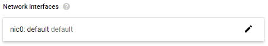
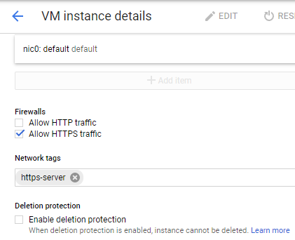

# Enabling High Availability for SAS Viya 3.5 in a Google Cloud Platform Environment

High availability (HA) is supported for SAS Viya deployments in Cloud
infrastructures. A clustered PGPool configuration, one of the mandatory
preconditions for HA SAS Viya deployments, typically requires a virtual IP
address. In Public Cloud environments, this network component is not available,
necessitating some additional configuration to work around this limitation. For
more information, see
[Best Practices for Floating IP Addresses](https://cloud.google.com/solutions/best-practices-floating-ip-addresses).

Starting with SAS Viya 3.5, HA is supported in public cloud environments with
some additional configuration. (It is not supported in earlier versions of SAS
Viya.) Use the examples in this document to prepare your Public Cloud
environment for a highly available deployment of SAS Viya 3.5.

The requirements to support a full HA deployment of SAS Viya 3.5 in a public
cloud, such as Google Cloud Platform (GCP), include the following:

- a component that can replace the virtual IP address that is required for
  highly available PostgreSQL (HA PGPool).

  In this document, the replacement component with which we have tested is a TCP
  load balancer.

- an HTTPS load balancer or gateway
- a shared file system

## Example Environment

Our test bed included the following components:

- 2 backend hosts running SAS Viya microservices and infrastructure servers
- 5 backend hosts for CAS (2 controllers and 3 workers)
- 3 backend hosts running PGPool and PostgreSQL
- a TCP load balancer with a public IP address, which redirects incoming
  connections on the PGPool port to a backend pool that includes the PGPool
  hosts
- a shared file system
- an application gateway
- a front-end jump server with a public IP address, which is used for login and
  acts as the Ansible controller.

A highly available deployment of SAS Viya requires redundant instances of key
components, chiefly the CAS server and SAS Infrastructure Data Server. The
distributed CAS server consists of one or more controller nodes (primary and
secondary) and two or more worker nodes.

HA SAS Infrastructure Data Server is a clustered PostgreSQL database containing
at least one PGPool instance and at least one data node. A SAS Infrastructure
Data Server cluster consists of three or more PGPool nodes (the pgpoolc host
group) and two or more PostgreSQL data nodes (the sasdatasvrc host group). It is
possible to colocate PGPool and the data nodes, but a minimum of three PGPool
instances is required.

An HA PostgreSQL cluster running on GCP requires a TCP Google Network Load
Balancer. The load balancer requires a service that uses either port 80 (HTTP)
or port 433 (HTTPS) and runs behind the firewall because the Google legacy
health check only allows HTTP and HTTPS health checks.

You can use more machines or dedicated hosts for the CAS server and PGPool
cluster, but our test bed corresponds to the minimum footprint and requirement
to have a full HA environment (where the environment will continue to work even
in the event of a machine failure).

_**IMPORTANT:**_&nbsp; If your SAS Viya software order included products that
use SAS Common Planning Service, additional resources will be required. These
products include SAS Assortment Planning, SAS Demand Planning, SAS Financial
Planning, and SAS Markdown Optimization. For more information, see
[Additional Setup for SAS Common Planning Service PostgreSQL](#optional-additional-setup-for-sas-common-planning-service-postgresql).

## Overview of Steps

[Example Environment](#example-environment)

[Architecture Diagram](#architecture-diagram)

[Setting Up HA SAS Viya on Google Cloud Platform](#setting-up-ha-sas-viya-on-google-cloud-platform)

[Create a VPC Network with a Subnet for the Deployment](#create-a-vpc-network-with-a-subnet-for-the-deployment)

- [Add Firewall Rules For Incoming Data](#add-firewall-rules-for-incoming-data)

[Create Virtual Machine Instances](#create-virtual-machine-instances)

- [Create a VM Instance for the Jump Server](#create-a-vm-instance-for-the-jump-server)
- [Create Additional VM Instances](#create-additional-vm-instances)

[Create an Unmanaged Instance Group (UIG)](#create-an-unmanaged-instance-group-uig)

[Create a TCP Load Balancer for HA PGPool](#create-a-tcp-load-balancer-for-ha-pgpool)

- [Backend Configuration](#backend-configuration)
- [Frontend Configuration](#frontend-configuration)

[Create the Google Cloud Filestore Share](#create-the-google-cloud-filestore-share)

[Create an HTTPS Load Balancer for the Apache HTTP Server](#create-an-https-load-balancer-for-the-apache-http-server)

[(Optional) Additional Setup for SAS Common Planning Service PostgreSQL](#additional-setup-for-sas-common-planning-service)

[Prepare to Run the Ansible Playbook](#prepare-to-run-the-ansible-playbook) 

[Verify Readiness of Target Machines](#verify-readiness-of-target-machines)

[Mount the Google Cloud Filestore Share on the Clients](#mount-the-google-cloud-filestore-share-on-the-clients) 

[Contributing](#contributing)

## Architecture Diagram


## Setting Up HA SAS Viya on Google Cloud Platform

Public Cloud on Google Cloud Platform has unique characteristics that we do not
attempt to predict in this document. Instead, we provide an example in order to
illustrate the required components. Generally, we did not test optional GCP
configurations.

Use the Google Cloud Console or your preferred command-line tool to perform
steps similar to the ones that we have documented in this example. In this
document, we describe the steps to take in the Cloud Console.

_**NOTE:**_ The steps and screen captures in this document were current as of
August 2020.

## Create a VPC Network with a Subnet for the Deployment

If you have not already set up a network in GCP where your VM instances will
run, set one up now. We recommend using custom mode to set it up.

1. In Google Cloud Console, navigate to the VPC networks page.
1. Click **Create VPC network**.
1. Specify a **Name** for the network to help you identify it.
1. For **Subnet creation mode**, select **custom**.
1. In the New subnet section, specify values for the following settings:

   - **Name** for the subnet.
   - Your **Region**.
   - An **IP address range** for the subnet. Specify an IP address and mask
     (CIDR), such as `10.1.1.0/24`.

   

1. Leave **Private Google access** at its default setting (disabled) for the
   subnet.
1. (Optional) Click to enable **VPC flow logs** for the subnet. Specify
   additional settings for flow logs, if desired.
1. Click **Done** to create the subnet.
1. Back in the Create a VPC network window, select **Regional** as the **Dynamic
   routing mode** for the network.
1. Click **Create**.

### Add Firewall Rules For Incoming Data

Create some firewall rules and apply them to the VPC network that you created
previously. Use the instructions below to create rules that specify the
following:

- allow all internal communications among All VMs that are in the subnet (all
  ports, all protocols)
- allow Google Cloud Healthcheck systems to contact the VMs that are in the
  instance group (35.191.0.0/16 and 130.211.0.0/22; see
  <https://cloud.google.com/load-balancing/docs/health-checks#fw-rule> for more
  information)
- allow the jump server to access VMs using SSH (port 22)
- allow HTTPS access (port 443) to the VMs

The first firewall rule is the most important. When you create it, be sure to
apply it to all targets in the VPC network. It must allow traffic to travel
among nodes in the subnet that you created previously and also allow incoming
traffic from any source within the subnet to the VM instances that will be
load-balanced.

1. In Google Cloud Console, navigate to the Firewall page.
1. Click **CREATE FIREWALL RULE**.
1. Specify a **Name** for the firewall rule.
1. Leave the **Logs** setting at the default (Off).
1. For the **Network** where the rule applies, select the network that you
   created previously.
1. Specify the **Priority** to apply to the firewall rule. Lower numbers
   indicate higher priorities. For this first rule, consider a high priority,
   such as 1.
1. Select **ingress** for the **Direction of traffic**.
1. Select **allow** for the **Action on match**.
1. For the **Targets** of the rule, select **All instances in the network**.
1. For **Source filter**, select **IP ranges**, and specify the IP address range
   of the subnet that you created previously.

   **_Note:_** If you plan to use an external jump server and you already know
   the IP address, add it now. You can specify multiple IP addresses, separated
   by commas.

1. In the **Protocols and Ports** section, click to select **Allow all**.

   

1. Click **Create**.
1. Now repeat the previous steps, but select **egress** for the **Direction of
   traffic**.
1. Select **allow** for the **Action on match**.
1. For the **Targets** of the rule, apply the egress rule to **All instances in
   the network**.
1. For **Destination filter**, select **IP ranges**, and specify the IP address
   range of the subnet that you created previously.
1. In the **Protocols and Ports** section, click to select **Allow all**.
1. Click **Create**.

Repeat these steps as needed to create additional ingress rules. Be sure to
allow traffic to flow to the required ports as described above. Here is an
example of the required ingress rules:


## Create Virtual Machine Instances

Create VM instances for HA SAS Viya. You will want multiple VM instances to host
the PostgreSQL components that support SAS Infrastructure Data Server (we had 3
VM instances for PostgreSQL), as well as multiple VM instances to run the CAS
server (we had 2 CAS controllers and 3 workers).

Perform basic steps to create VM instances to host SAS Viya components and an
additional VM for the jump server, which requires an SSH key. Then add the VM
instances to the dedicated subnet that you created previously. If desired, use
one of your enterprise's custom or trusted images as a template.

First, create an SSH public key for the Ansible controller (which, in these
instructions, you will install on a VM jump server). Use Git Bash or another
tool to generate the key.

### Create a VM Instance for the Jump Server

We will create the jump server next. If you already have a host that will be
used as a jump host, you can use the steps in this section as guidance for
setting up the VM instances that will host SAS Viya components. A jump server VM
instance that runs in the same VPC network as the HA cluster is optional.

1. In Google Cloud Console, navigate to the VM instances page.
1. Select your project and click **Continue**.
1. Click **Create instance**.
1. Specify a **Name** for your instance.
1. (Optional) Add labels if desired.
1. Specify values for the following options:
   - **Region** and **Zone**
   - **Machine family**: Select **General-purpose**
   - **Series**: Select the machine series based on this machine's likely role
     within the SAS Viya deployment. In most cases, E2 is sufficient. You might
     want to select a more powerful machine series for the CAS server machines.
   - **Machine type**: Select a machine with sufficient VCPU and RAM resources.
1. Scroll to the **Boot disk** option and click **Change**. The Boot disk dialog
   box is displayed.
1. Click the **Public images** tab.
1. Select **Red Hat Enterprise Linux** for the **Operating System**, and select
   **Red Hat Enterprise Linux 7** for the **Version**.
1. For **Boot Disk Type**, you can leave the default (Standard persistent disk
   20 GB).
1. Click **Select** to confirm your options. You return to the Create an
   instance page.
1. In the **Identity and API Access** section, leave the default settings for
   **Service account** and **Access scopes**.

1. Scroll past the **Firewall** section and do not configure these settings at
   this time.
1. Expand the link labeled **Management, security, disks, networking, sole
   tenancy**.
1. If necessary, scroll back up to locate and click the **Security** tab.
1. In the field labeled `Enter public ssh key`, paste in the SSH public key that
   you created in Step 1. This key will enable communications with the Ansible
   controller.

1. Append any SSH user name to the end of the SSH public key. This name is used
   in the inventory.ini file as the `ansible_user`. For example, if
   `ssh-rsa XXXXXXXXXXXXXXXXXXXXXXXX viyadep` is pasted, the user `viyadep` is
   created.
1. Click the **Networking** tab.
1. (Optional) Specify **Network tags** if desired.
1. Click to edit the default NIC that is displayed in the **Network interfaces**
   field.

   

   A set of Network interface options is displayed.

   

1. Leave the default setting for the **Primary internal IP**.
1. For the **External IP**, the default setting is **Ephemeral**, which means
   that a new external IP address will be assigned to the jump server VM
   instance each time it is restarted. If you want to make the IP static, you
   can select **Static external IP address**; however, a static IP address costs
   more.

1. Select **Premium** for the **Network Service Tier**.
1. Leave the **IP forwarding** and **Public DNS PTR Record** options disabled
   (the default).
1. Click **Create** to create the first VM instance. Information about the VM is
   displayed.
1. Write down the static external IP address that is displayed along with other
   identiying information about the VM. As you prepare for the SAS Viya
   deployment, you will specify this address in inventory.ini for the
   `ansible_host` variable.

### Create Additional VM Instances

Repeat the steps in the previous section,
[Create a VM Instance for the Jump Server](#create-a-vm-instance-for-the-jump-server),
as needed to create all the VM instances for your HA cluster. If desired, click
the VM instance that you just created and then use the **Create similar** button
to create additional instances with fewer steps. However, the IP address
requirements for these machines might require you to edit each instance.

The VM instances that host SAS Viya components do not need external IP addresses
unless your jump server will be external to the VPC network. The following table
summarizes the required IP address settings for your VM instances in two jump
server scenarios:

| When jump host is       | Set primary internal IP of other VMs to | Set external IP of other VMs to |
| ----------------------- | --------------------------------------- | ------------------------------- |
| Internal to VPC network | Default (Ephemeral)                     | None (no External IP address)   |
| External to VPC network | Default (Ephemeral)                     | Static External IP              |

- If your jump server is external to your VPC network, you must specify the
  option to **Reserve static external IP address** for the **External IP** when
  you edit the default NIC. The Reserve a new static IP address dialog box lets
  you specify a name for the IP address to help you identify it:

  

- If your jump server is in the same VPC network and subnet as your other VMs,
  you can disable external IP addresses for the remaining VM instances. Select
  **None** for **External IP** when you edit the default NIC for each VM
  instance:

  

## Create an Unmanaged Instance Group (UIG)

Create an unmanaged instance group in the dedicated subnet that you created
previously, and associate it with the same region and zone as your VM instances.
In Google Cloud Platform, unmanaged instance groups enable you to load balance
across a group of VM instances that you manage yourself.

An unmanaged instance group consists of VM instances that are associated with
the same zone, network, and subnet. In this case, these will be in the backend
group that is managed by the Google Cloud load balancer.

1. In Google Cloud Console, navigate to the Instance Groups page.
1. Click **CREATE AN INSTANCE GROUP**.
1. Click **New unmanaged instance group**.
1. Specify a **Name** for the unmanaged instance group that will help you
   identify it.
1. In the **Location** section, select the **Region** and **Zone** for the new
   UIG.

   Your HA cluster will use an HTTPS load balancer to route traffic to instances
   of the SAS Viya HTTP Server. Define an HTTP service and map a port name so
   that the load balancer can forward traffic to the SAS Viya Apache HTTP Server
   hosts.

1. Click the link to **Specify port name mapping**.
1. For **Port name**, specify a name to identify the port, such as **http**.
1. For the **Port number**, specify **80**.

   

1. For the **Network** and **Subnetwork**, select the VPC network and subnet
   that you created previously.
1. For **VM instances**, select the VM instances for the PGPool cluster, which
   will run in the back end of the load balancer.

   > _**NOTE:**_ You will create the load balancer as a separate step.

1. Click **Create**.

## Create a TCP Load Balancer for HA PGPool

Use the Google Cloud Console to create a TCP load balancer and health checks for
your HA deployment. The TCP load balancer is internal to your Google Cloud
network. It takes the place of the virtual IP address that is required to
support high availability for PGPool instances.The health checks are needed to
detect outages and initiate failover measures.

1. In Google Cloud Console, select **Network Services** and click **Load
   Balancing** in the left pane.
1. Click **Create Load Balancer**.
1. On the Create a load balancer page, in the **TCP Load Balancing** section,
   click **Start configuration**.
1. Specify values for the following options:
   - For **Internet facing or internal only**, select **Only Between My VMs**
   - For **Multiple regions or single region**, select **Single region only**
1. Click **Continue**.
1. Specify a **Name** for the load balancer to help you identify it.
1. Click **Create**.

Next, configure the backend services.

### Backend Configuration

Set up backend services and a health check for the load balancer.

1. Click **Backend configuration**.
1. Specify values for the following options:
   - For **Region**, select the same region as the VM instances.
   - For **Network**, select the VPC network that you created previously.
1. In the **Backends** section, select your unmanaged instance group from the
   **Instance group** menu.
1. Leave the check box labeled **Use this instance group as a failover group for
   backup?** unchecked.
1. Click **Done**.
1. For **Health check**, select **Create health check**.
1. In the Create a health check configuration pane, complete the following
   settings:

   - Specify a **Name** for the health check to help you identify it.
   - For the **Protocol**, select **TCP**.
   - For the **Port** for the health check, specify `5431` (PGPool port).

   

Next, configure the frontend services.

### Frontend Configuration

Select network settings for the load balancer.

1. Click **Frontend Configuration**.

1. Specify a **Name** for the IP address to help you identify it.
1. For **Subnetwork**, select the subnet that you created previously, in
   [Create a VPC Network with a Subnet for the Deployment](#create-a-vpc-network-with-a-subnet-for-the-deployment).
1. For **Internal IP**, select **Non-shared**.
1. From the **IP address** menu, select **Reserve Internal Static IP**.
1. Select **Assign automatically**.
1. Record the assigned static internal IP address. You will specify this address
   in the vars.yml file for the value of the `HA_PGPOOL_VIRTUAL_IP` variable.

1. For the **Port**, select **Multiple ports**, and specify a comma-separated
   list of port numbers: `5431, 5430, 7` (for PGPool, PCP, and the SAS Viya
   Backup Service, respectively).
1. Leave **Global access** set to **Disabled**.
1. Click **Review and finalize**.

1. Verify your settings for the load balancer. Then click **Create**.

## Create the Google Cloud Filestore Share

Google Cloud Filestore is a storage service that supports applications that
require a shared file system for data. The VM instances in your HA deployment of
SAS Viya require a shared file system on a persistent storage volume. For
example, a shared user's Home directory is required for SAS Studio.

1. In Google Cloud Console, go to the Filestore page.

   > _**NOTE**_: These instructions use the Filestore page in Google Cloud
   > console and not the Cloud Filestore.

1. Click **Create Instance**.
1. Specify a **Name** for your filestore instance to help you identify it. Add a
   **Description** if desired.
1. In the **Configure service tier** section, select the **Instance type**
   (Basic or High-Scale) and the **Storage type** (Basic HDD, Basic SSD, or
   High-Scale SSD) to create the service tier.

   

1. Set the size of the filestore in the **Allocate Capacity** field. The minimum
   size, 1 TB, is typically adequate.
1. In the **Choose where to store your data** section, the correct **Region**
   and **Zone** should be displayed automatically.
1. In the **Set up connections** section, select your network from the **VPC
   network** menu.
1. (Optional) For the **Allocated IP range**, select **Use a custom IP range**
   if desired, and configure the custom range.
1. In the **Configure your fileshare** section, specify a **Name** for the file
   share to identify it.

   

1. For **Access Control**, leave the default setting, which grants access to all
   VM instances on the network.
1. Click **Create**.

## Create an HTTPS Load Balancer for the Apache HTTP Server

Set up an HTTPS load balancer for the httpd components that are deployed on our
SAS Viya Services hosts. Secure it with a Google-managed certificate.

1. In Google Cloud Console, navigate to the Load balancing page.
1. Click **Create load balancer**. The Create a load balancer page displays.
1. In the **HTTP(S) Load Balancing** section, click **Start configuration**.
1. In the **Internet facing or internal only** section, select **From Internet
   to my VMs**.
1. Click **Continue**.
1. Specify a **Name** for the load balancer.

Now configure the backend services.

### Backend Configuration

Set up backend services and a health check for the load balancer. Setting up the
backend creates a URL map to route the incoming requests to the default backend
service.

1. Click **Backend configuration**.
1. From the **Create or select backend services & backend buckets** menu, select
   **Backend services**, **Create a backend service**.

   

   - Specify a **Name** for the backend service.
   - For **Backend type**, select **Instance group** (the default).
   - For the **Protocol**, select **HTTP**.
   - For the **Named port**, specify `http`.
   - Specify a shorter **Timeout**, or leave the default (30 secs).

1. In the **Backends** section, for **Instance group**, specify the unmanaged
   instance group that you created previously.
1. For **Port numbers**, specify Port **80** for traffic between the load
   balancer and the instances.
1. A value for **Maximum RPS** (maximum requests per second that can be sent to
   the backend instances) is required. However, you can click in the field and
   select **per instance** so that a value of `unlimited` is registered.
1. Leave the default values for the remaining fields.
1. Click **Done**.

   

   Now create an HTTPS health check for the backend.

1. Still in the Create backend service configuration pane for the load balancer,
   leave the check box unchecked for **Enable Cloud CDN**.
1. Select **Create a health check** from the Health check menu. A separate
   Health check configuration pane is displayed.
1. Set the following parameters:
   - Specify a **Name** for the health check
   - Specify a **Description** of the health check to help you identify it
   - For the **Protocol**, select **HTTPS**
   - For the **Port**, `443` is selected automatically
1. Leave the default values for the remaining fields, including the **Check
   interval** and **Threshold** values.

   

1. Click **Save and Continue**. You return to the Create backend service
   configuration pane.
1. Click **Create** to create the backend service for the HTTPS load balancer.

When you complete the configuration of the backend service, you return to the
New HTTP(S) load balancer window. If you want to change any URL settings, click
**Host and Path Rules**. These rules determine whether traffic is directed to a
backend service or to a storage bucket and how user request URLs are handled.
Proceed through the Host and Path Rules section, leaving the default values in
place, which direct Any traffic to the backend service that you created. By
default, URLs are not transformed.

Now configure the frontend service.

### Frontend Configuration

1. Return to the New HTTP(S) load balancer window and click **Frontend
   configuration**. The Frontend configuration pane is displayed.
1. Set the following parameters:
   - Specify a **Name** for the external IP address that will be assigned to the
     HTTPS load balancer
   - For **Protocol**, select **HTTPS**
   - For **Network Service Tier**, select **Premium**
1. For IP address, select **Create IP address** from the menu. The Reserve a new
   static IP address configuration pane is displayed.

1. Specify a **Name** for the external IP address, and click **Reserve**.
1. From the **Certificate** menu, select **Create a new certificate**.

   

   The Create a new certificate dialog box is displayed.

1. Specify a **Name** for the new certificate.
1. For **Create mode**, select **Google-Managed certificate**.
1. Specify your **Domain**. For example, specify `my-company.com` and press
   **Enter**.
1. Click **Create**.

1. Back in the Frontend configuration pane, scroll to the bottom and click
   **Done**.
1. In the New HTTP(S) Load Balancer pane, click **Review and Finalize** if
   desired.
1. When you are satisfied, click **Create** to create the HTTPS load balancer.

## (Optional) Additional Setup for SAS Common Planning Service PostgreSQL

If your SAS Viya software order included products that use SAS Common Planning
Service, additional resources might be required. For orders that include SAS
Assortment Planning, SAS Demand Planning, SAS Financial Planning, or SAS
Markdown Optimization, the deployment must include SAS Common Planning Service
PostgreSQL (or "CPSPostgres"). You have two options:

1. Deploy CPSPGPool without high availability (a single CPSPGPool instance)
1. Deploy HA CPSPGPool (clustered CPSPGPool instances)

If you select Option 2, you must create another TCP load balancer by repeating
the steps described previously, in
[Create a TCP Load Balancer for HA PGPool](#create-a-tcp-load-balancer-for-ha-pgpool).
Apply the following requirements as you complete those steps:

1. Use port numbers that differ from those that PGPool is using. The port
   numbers are specified in vars.yml.
1. Use the CPSPGPool port number for the backend health check.
1. Use a different static external IP address for the load balancer frontend
   service.
1. Use the same unmanaged instance group.

The inventory.ini file must include the hosts of CPSPGPool instances. In the
vars.yml file, specify the following in the `INVOCATION_VARIABLES` section, just
as you would for the regular PGPool hosts:

```yaml
cpspgpoolc:
  - HA_PGPOOL_VIRTUAL_IP=
  ## Supply the value of the IP address assigned to the CPSPGPool load balancer
  - HA_PGPOOL_WATCHDOG_PORT=
## Supply the port value. It might be the same as for PGPool because they are on different hosts
```

For `HA_PGPOOL_VIRTUAL_IP`, take the same steps as above in
[Create a TCP Load Balancer for HA PGPool](#create-a-tcp-load-balancer-for-ha-pgpool).

- When you select settings for the **Frontend Configuration**, again create a
  non-shared **Internal IP**.
- From the **IP address** menu, select **Reserve Internal Static IP**.
- Select **Assign automatically**.
- Record the static internal IP address that is assigned by Google Cloud
  Platform. This is the IP address that you must use as the value of
  `HA_PGPOOL_VIRTUAL_IP` in the vars.yml file when you modify the playbook.

## Prepare to Run the Ansible Playbook

If required, take the steps described in
[(Optional) Additional Setup for SAS Common Planning Service PostgreSQL](#optional-additional-setup-for-sas-common-planning-service-postgreSQL)
before you edit the playbook.

Follow the instructions in the
[SAS Viya Deployment Guide](https://documentation.sas.com/?docsetId=dplyml0phy0lax&docsetTarget=p06vsqpjpj2motn1qhi5t40u8xf4.htm&docsetVersion=3.5&locale=en)
for Linux in order to complete the following steps:

- Verify Linux
  [prerequisites](https://go.documentation.sas.com/?docsetId=dplyml0phy0lax&docsetTarget=n19vw6gi000spun1sq96qgvsaeef.htm&docsetVersion=3.5&locale=en)
  and perform required
  [pre-installation tasks](https://documentation.sas.com/?docsetId=dplyml0phy0lax&docsetTarget=p16gork369vpprn19tm1cind681o.htm&docsetVersion=3.5&locale=en)
- Download SAS Mirror Manager and
  [create a mirror repository](https://documentation.sas.com/?docsetId=dplyml0phy0lax&docsetTarget=p1ilrw734naazfn119i2rqik91r0.htm&docsetVersion=3.5&locale=en)
  on the jump server
- [Install Ansible](https://documentation.sas.com/?docsetId=dplyml0phy0lax&docsetTarget=p1puupgtsay2r5n1h6k11n6lpl97.htm&docsetVersion=3.5&locale=en)
  on the jump server
- Edit the
  [inventory file](https://go.documentation.sas.com/?docsetId=dplyml0phy0lax&docsetTarget=p049t0kjjzyyiqn1wb3m0u1uao02.htm&docsetVersion=3.5&locale=en)
  to reflect your hosts. You can use this example file as a guide:
  <https://gitlab.sas.com/xeno/viya-in-azure-reference-architecture/-/blob/master/artifacts/ha-inventory.ini>
- In the vars.yml file,
  [described in detail here](https://documentation.sas.com/?docsetId=dplyml0phy0lax&docsetTarget=n1knvzbsifo9xqn1al0bh7wxrrkg.htm&docsetVersion=3.5&locale=en),
  define your pgpool cluster topology. Specify the static network IP address for
  the `HA_PGPOOL_VIRTUAL_IP` variable in vars.yml.

### Verify Readiness of Target Machines

Add the `https-server` network tag to the VM instance that is the deployTarget
for the [httpproxy] host group, the intended host of the Apache HTTP Server. The
Apache HTTP Server provides security and load balancing for multiple SAS Viya
components.

1. In Google Cloud Console, navigate to the VM instances page.
1. Click the link that corresponds to the VM instance where you will deploy the
   Apache HTTP server.

   The VM instance page displays.

1. Click **Edit**.
1. Scroll down past the Firewalls section to the **Network tags** section.
   Specify one or more tags, separated by commas.

   

1. Click **Save**.

SAS Message Broker requires a fully qualified domain name (FQDN). This server
corresponds to the machine target for the [rabbitmq] host group in
inventory.ini. Verify that each [rabbitmq] host has an FQDN by running
`hostname -A`. If necessary, edit the `/etc/hosts` file to set the FQDN.

## Mount the Google Cloud Filestore Share on the Clients

You created a Google Cloud Filestore share previously, in
[Create the Google Cloud Filestore Share](#create-the-google-cloud-filestore-share).

1. Install the nfs client on each VM instance. Here is an example that uses
   Ansible:

   ```yaml
   ansible sas-all -m yum -a "name=nfs-utils state=present" -b
   --private-key=~/.ssh/<key-file-name> --user=<installation-user>
   ```

1. Prepare a shared home directory, which is required for HA SAS Studio. This
   example uses Ansible:

   ```yaml
   # create /shared home dir on SAS Viya hosts
   ansible <host-name>* -m file -a "name=/sharedhome state=directory owner=sas group=sas mode=0755" -b --private-key=~/.ssh/<key-file-name> --user=<installation-user>
   # mount the shared fs on /sharedhome
   ansible <host-name>* -m mount -a "path=/sharedhome state=mounted src='10.0.0.2:/vol1' fstype=nfs opts=defaults" -b --private-key=~/.ssh/<key-file-name> --user=<installation-user>
   ```

1. Prepare the required shared directory for the CAS server. This example uses
   Ansible:

   ```yaml
   # pre-create /opt/sas/viya/config/data/ dir on the CAS controller hosts
   ansible cas-host-01,cas-host-02 -m file -a "path=/opt/sas/viya/config/data/ state=directory owner=sas group=sas mode=0755" -b --private-key=~/.ssh/<key-file-name> --user=<installation-user>
   # create /mnt/sharedcas dir on the CAS controller hosts
   ansible cas-host-01,cas-host-02 -m file -a "path=/mnt/sharedcas state=directory owner=sas group=sas mode=0755" -b --private-key=~/.ssh/<key-file-name> --user=<installation-user>
   # mount the shared fs on /mnt/sharedcas
   ansible cas-host-01,cas-host-02 -m mount -a "path=/mnt/sharedcas state=mounted src=10.0.0.2:/vol1 fstype=nfs opts=defaults" -b --private-key=~/.ssh/<key-file-name> --user=<installation-user>
   # create the shared cas dir on the shared fs
   ansible cas-host-01 -m file -a "name=/mnt/sharedcas/cascontrollers state=directory owner=sas group=sas mode=0755" -b --private-key=~/.ssh/<key-file-name> --user=<installation-user>
   # create the symlink /opt/sas/viya/config/data/cas on CAS controllers pointing to /mnt/sharedcas/cascontrollers
   ansible cas-host-01,cas-host-02 -m file -a "src=/mnt/sharedcas/cascontrollers dest=/opt/sas/viya/config/data/cas state=link" -b --private-key=~/.ssh/<key-file-name> --user=<installation-user>
   ```

   Ansible creates and mounts the file share and enables SSH access to it.

## Contributing

We welcome your contributions! Please read [CONTRIBUTING.md](../CONTRIBUTING.md)
for details on how to submit contributions to this project.
