# Enabling High Availability for SAS Viya 3.5 in a Microsoft Azure Cloud Environment

High availability (HA) is supported for SAS Viya deployments in Cloud
infrastructures. A clustered PGPool configuration, one of the mandatory
preconditions for HA SAS Viya deployments, typically requires a virtual IP
address. In Public Cloud environments, this network component is not available,
necessitating some additional configuration to work around this limitation.

Starting with SAS Viya 3.5, HA is supported in Public Cloud environments with
some additional configuration. (It is not supported in earlier versions of SAS
Viya.) Use the examples in this document to prepare your Public Cloud
environment for a highly available deployment of SAS Viya 3.5.

The requirements to support a full HA deployment of SAS Viya 3.5 in a Public
Cloud, such as Microsoft Azure, include the following:

- a component that can replace the virtual IP address that is required for
  highly available PostgreSQL (HA PGPool).

  In this document, the replacement component with which we have tested is a TCP
  load balancer.

- an HTTPS application gateway
- a shared file system

## Overview of Steps

[[_TOC_]]

## Example Environment

Our test bed included the following components:

- 2 backend hosts running SAS Viya microservices and infrastructure servers
- 5 backend hosts for CAS (2 controllers and 3 workers)
- 3 backend hosts running SAS Infrastructure Data Server (PGPool and PostgreSQL)
- a TCP load balancer with a public IP address, which redirects incoming
  connections on the PGPool port to a backend pool that includes the PGPool
  hosts
- a shared file system (Azure files)
- an application gateway
- a VM configured as a virtual machine with a public IP address, referred as the
  "jump server". This machine is used to access the other VM instances and also
  plays the role of the Ansible Controller.

A highly available deployment of SAS Viya requires redundant instances of key
components, chiefly the CAS server and SAS Infrastructure Data Server. The
distributed CAS server consists of one or more controller nodes (primary and
secondary) and two or more worker nodes.

HA SAS Infrastructure Data Server is a clustered PostgreSQL database containing
at least one PGPool instance and at least one data node. A SAS Infrastructure
Data Server cluster consists of three or more PGPool nodes (the pgpoolc host
group) and two or more PostgreSQL data nodes (the sasdatasvrc host group). It is
possible to colocate PGPool and the data nodes, but a minimum of three PGPool
instances is required.

You can use more machines or dedicated hosts for the CAS server and PGPool
cluster, but our test bed corresponds to the minimum footprint and requirement
to have a full HA environment (where the environment will continue to work even
in the event of a machine failure).

_**IMPORTANT:**_&nbsp; If your SAS Viya software order included products that
use SAS Common Planning Service, additional resources will be required. These
products include SAS Assortment Planning, SAS Demand Planning, SAS Financial
Planning, and SAS Markdown Optimization. For more information, see
[Additional Setup for CPSPGPool](#additional-setup-for-cpspgpool).

## Architecture Diagram

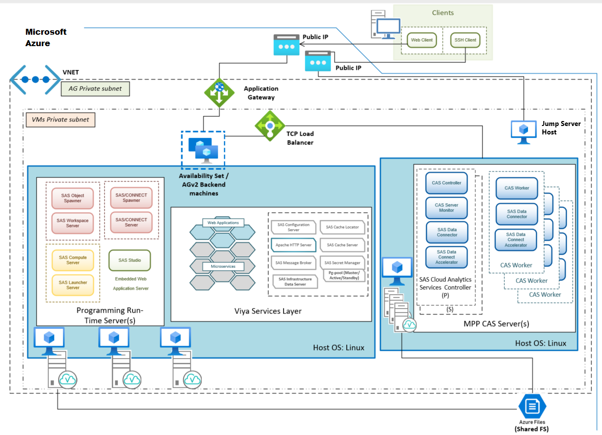

## Setting Up HA SAS Viya on Microsoft Azure

Public Cloud on Microsoft Azure has unique characteristics that we do not
attempt to predict in this document. Instead, we provide an example in order to
illustrate the required components. Generally, we did not test optional
configurations.

Use the Microsoft Azure user interface or your preferred command-line tool to
perform steps similar to the ones that we have documented in this example. In
this document, we describe the steps to take in the Azure Portal.

_**NOTE:**_ The steps and screen captures in this document were current as of
September 2020.

### Create a Resource Group

SAS strongly recommends that you use a dedicated Microsoft Azure resource group
for the SAS Viya deployment.

Create a resource group and make it the default group for the next configuration
steps.

1. On the Microsoft Azure Portal home page, click **Resource groups**.
1. On the Resource Groups page, click **+Add**. The Create a resource group page
   appears.
1. Your **Subscription** and **Region** are populated based on your account.
1. For **Resource group**, specify a name to help you identify the new resource
   group.
1. Click to add **Tags** if desired. Then click **Review and Create** to review
   your work.
1. Click **Create**.

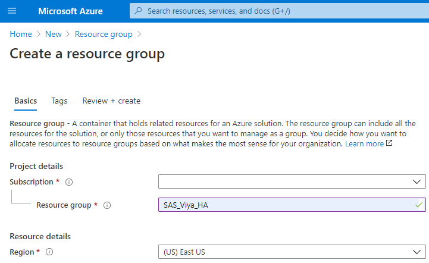

The Azure Portal does not yet provide a way to make a resource group the default
group. You can use the Azure CLI for this purpose, however. If you do not want
to use the CLI to make the resource group the default group, you must first
select the resource group from the Azure Services area of the main portal page
before adding any other resources as described in this document.

To use the CLI, first create the resource group. Then run the following command:

```console
az configure --defaults group=${RG} location=${LOCATION}
```

For `{RG}`, specify your resource group. For `{LOCATION}`, specify your
location.

### Create a Public IP Address for the Load Balancer

Create a static public IP address for the load balancer.

1. On the Azure Portal home page, do a search for **Public IP address**.
1. On the Public IP addresses page, click **+Add**.
1. On the Basics tab, specify the following values for the IP address settings:

   - **Subscription**: Your Microsoft Azure subscription
   - **Resource Group**: The resource group that you created previously
   - **Region**: Your region
   - **SKU**: Standard

1. Click **Next: Configuration >**.
1. On the Configuration tab, specify the following values for the IP address
   settings:

   - **IP version**: IPv4

   - **Name**: Specify a name to help you identify the public IP address for the
     load balancer.
   - **IP address assignment**: Static (the default)
   - **Idle timeout**: Use the slider to increase the default timeout, if
     desired
   - **DNS name label**: Specify a label that Azure appends to the DNS domain,
     such as `my-company-name`.

   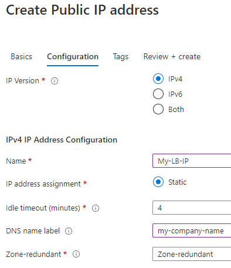

1. Click **Create**.
1. Record the IP address that you have created.

   You will need to specify this address for the HA_PGPOOL_VIRTUAL_IP variable
   in the vars.yml file that the playbook uses for the deployment.

### Create a Virtual Network and Subnet

Create a virtual network with at least one subnet. (The default subnet can be
used for this purpose).

1. On the Azure Portal home page, click **Create a Resource**. Click
   **Networking** in the list on the left and select **Virtual network**.
1. On the Create virtual network page, specify values for the following
   settings:

   - **Subscription**: (Your subscription is populated)
   - **Resource group**: Select the resource group that you created previously
     if it is not populated
   - **Name**: Specify a name to help you identify the network when you
     configure additional components, such as load balancers
   - **Region**: (Your region is populated)

1. Click **Next: IP Addresses >**. Specify an IP address and mask for **IPv4
   address space**. For example, specify `10.1.0.0/16`.
1. Click **Add subnet** and specify a name for **Subnet name**.
1. For **Subnet address range**, specify a value such as `10.1.0.0/24`.
1. Click **Add**.
1. Accept the default Networking settings, or click **Next > Networking** to
   make changes.
1. Click **Review + create**. Check your work and click **Create**.

Microsoft Azure takes a few moments to create the resource. A message stating
that `Your deployment is complete` appears when the network has been created.

## Create a Network Security Group

A network security group is required for the virtual network that you will
create for your VM instances. You will also create inbound security rules as a
separate step.

1. On the Azure Portal home page, click **Create a Resource**, and click
   **Networking**.
1. Click **Network security group**.
1. On the network security groups page, click **+Add**.
1. under the **Basics** tab, specify values for the following settings:
   - **Subscription**: (Your subscription is populated)
   - **Resource group**: Select the resource group that you created previously
     if it is not populated
   - **Name**: Specify a name to help you identify the network security group
   - **Region**: (Your region is populated)
1. Click **Next > Tags**.
1. Add tags to your network security group, if desired.
1. Click **Review + create**. If the validation check passes, click **Create**.

Azure takes a few moments to create the resource. A message stating that
`Your deployment is complete` appears when the network security group has been
created.

### Configure the Network Security Group

Now add your virtual network, subnet, and security rules to your network
security group. You must create inbound security rules to enable access to the
VM instances on Ports 22 (SSH), 80 (HTTP), 443 (HTTPS), 5431 (PGPool), 5430
(PCP), and 7 (SAS Viya Backup Service).

1. From the network security group page, click **Go to Resource**. Or, from the
   Azure Portal home page, search for the name that you specified for the
   network security group that you created previously. When the group appears in
   the search results, select it.

1. Associate your network: in the Azure portal menu under Settings, click
   **Subnets**. Above the Subnets list, click **+ Associate**.
1. In the **Associate subnet** dialog box, select the network that you created
   previously from the **Virtual network** list.
1. For **Subnet**, select the subnet that you created previously.
1. Click **OK**, and close the dialog box.
1. In the Settings panel on the left, click **Inbound security rules**.
1. Click **+ Add**.

1. Specify values for the following options:

   - **Source**: Select **IP Addresses**
   - **Source IP addresses/CIDR ranges**: Specify a comma-separated list of IP
     addresses as the source of the incoming traffic. Be sure to add your
     virtual network and your jump server host.
   - **Source port ranges**: Specify **Any**
   - **Destination**: Select **Any**
   - **Destination port ranges**: Specify the following comma-separated list of
     ports that are required by SAS Viya components:
     - `22,80,443,5431,5430,7`
   - **Protocol**: TCP (default)
   - **Action**: Allow (default)
   - **Priority**: Specify 100 or higher. Rules are processed in priority order.
     Lower numbers have higher priority.
   - **Name**: Specify a name to help you identify the inbound security rule.
   - **Description**: (Optional)

     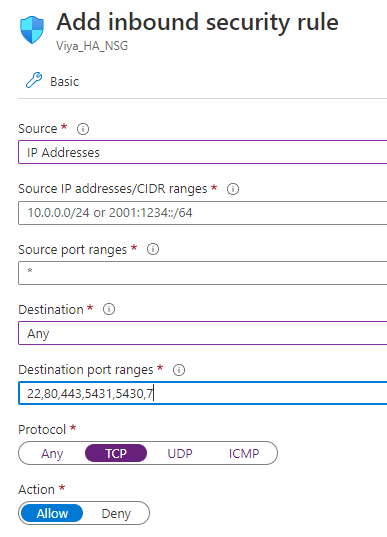

1. Click **Add** to create the security rule.

If you specify them in separate rules, be sure to add rules to allow incoming
TCP traffic on all the required ports.

## Create a TCP Load Balancer

Create a TCP load balancer and health probes for your HA deployment. The TCP
load balancer is internal to your Azure cloud network. It takes the place of the
virtual IP address that is required to support high availability for PGPool
instances. You will add VM instances that will host PGPool to the backend of
this load balancer as a separate step.

The health probes are needed to detect outages and initiate failover measures.

1. On the Azure Portal home page, click **Create a Resource**.
1. Search for **Load Balancer** and select it. Click **Create**.
1. On the **Basics** tab of the Create Load Balancer page, specify values for
   the following settings:

   - **Subscription**: (Your subscription is populated)
   - **Resource group**: Select the resource group that you created previously
     if it is not populated
   - **Name**: Specify a name for the Load balancer to help you identify it
   - **Region**: (Your region is populated)
   - **Type**: Select **Public**
   - **SKU**: Select **Standard**
   - **Public IP address**: Click **Use existing**. Then select the static
     public IP address that you created previously in
     [Create a Public IP Address for the Load Balancer](#create-a-public-ip-address-for-the-load-balancer).

1. Click **Next: Tags>** and add tags if desired.

1. Click **Review + create**. Check your work and click **Create**.

### Configure the Load Balancer

Select options for the TCP load balancer that you created.

1. When you see a message stating that your load balancer deployment is
   complete, click **Go to Resource** to complete load balancer configuration.
1. In the **Configure high availability and scalability for your applications**
   section of the page, click View backend pools.
1. On the Backend Pools page, click **+Add**.
1. Specify values for the following settings:

   - **Name**: Specify a name for the backend pool to help you identify it
   - **Virtual network**: Select the virtual network that you created
     previously.
   - **IP version**: (Leave the default; only IPv4 is supported)
   - **Associated to**: Select **Virtual machines**

   > _**NOTE**_: You will create VM instances to associate with the load
   > balancer as a separate step.

1. Click **Add** to create the backend pool. The Backend pools list appears.
1. In the **Settings** section on the left, click **Health probes**.
1. Create a health probe for HA PGPool with the following settings:

   - **Protocol**: TCP
   - **Port**: 5431 (default PGPool port)
   - **Interval**: 10 seconds
   - **Unhealthy threshold**: 2 consecutive failures

   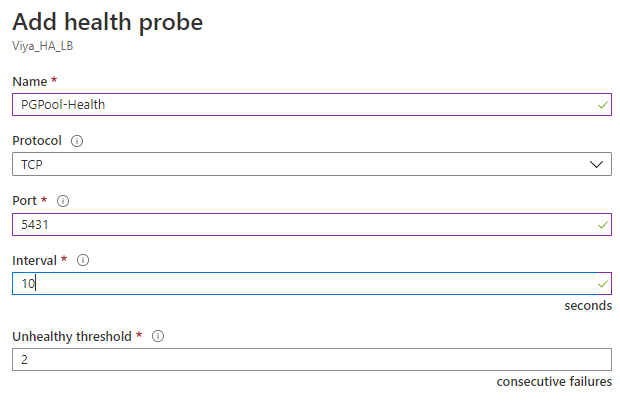

1. Click **OK** to save the health probe.

## Create Virtual Machine Instances

Create VM instances for HA SAS Viya. You will want multiple VM instances to host
the PostgreSQL components that support SAS Infrastructure Data Server (we had 3
VM instances for PostgreSQL), as well as multiple VMs to run the CAS server (we
had 2 CAS controllers and 3 workers). You will perform the same basic steps to
create all VM instances with the exception of an additional VM for the jump
server, which we describe later.

1. On the Azure Portal home page, search for **virtual machines**.
1. On the Virtual Machines page, click **+Add**.
1. On the **Basics** tab, specify values for the following options in the
   Project Details section:

   - **Subscription**: (Your subscription is populated)
   - **Resource Group**: Select the resource group that you created previously
     if it is not populated.

1. In the Instance Details section, specify values for the following settings:

   - **Virtual Machine Name**: A name to identify the VM. It is a best practice
     to assign names that identify the intended SAS Viya component that the
     machine will host, such as PGPool-1 or CAS-Worker-2.
   - **Region**: The region where the machine will run
   - **Availability Options**: A redundancy option for the VM. Click **Create
     New**, or select an availability set that you created previously.
     > _**NOTE**_: Instances with a different availability set cannot be placed
     > in the same backend pool for the load balancer.
   - **Image**: Click **Browse all public and private images** to select your
     operating system. SAS recommends using Red Hat Enterprise Linux 7.3 or
     later. Red Hat Enterprise Linux 8.0 is not yet supported.
     > _**NOTE**_: SAS Viya supports additional operating systems; however, we
     > have not tested the instructions for setting up a high-availability
     > deployment on Microsoft Azure with other operating systems.
   - **Azure spot instance**: (SAS has not tested with this option enabled.)
   - **Size**: Select the VM Size that you want. The Azure region that you
     selected and your budget determine the options that are available. SAS
     recommends:

     - At least 8 VCPUs
     - At least 64 GB of memory (Standard_E8s_v3, for example)

     > _**NOTE**_: SAS recommends consulting with a sizing expert to obtain an
     > official hardware recommendation that is based on your deployment type,
     > the estimated SAS workload, and the number of users. To request sizing
     > expertise, contact your SAS account representative.

1. In the Administrator Account section, select **SSH public key** for the
   **Authentication type**.

   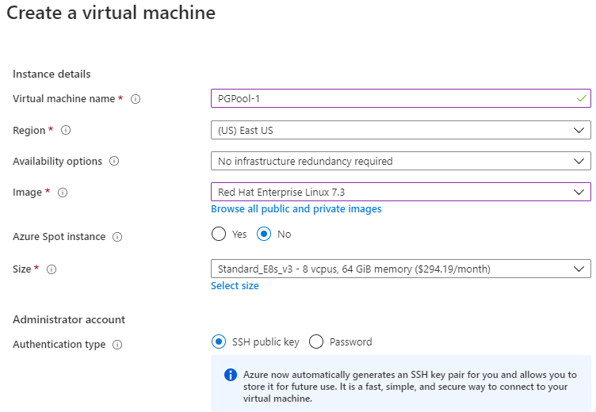

1. For **SSH public key source**, select **Use existing public key**.
1. Paste your SSH key in the field labeled **SSH public key**. Delete any
   leading or trailing white space.
1. Specify the **Username** of a VM administrator who can log in to the VM.

1. In the Inbound port rules section, select **None** for **Public inbound
   ports**.
1. Click the **Disks** tab near the top of the page.
1. On the Disks page, select an OS disk type from the **Disk Options** section.
1. For **Encryption type**, leave the default setting (Encryption at-rest with a
   platform-managed key).
1. Click **Create and attach a new disk**.
1. On the Create a new disk page, select the following options for the disk:

   - **Source type**: None (empty)
   - **Size**: Specify at least 70 GiB (100 GiB are recommended)

   > _**NOTE:**_ You will format and mount the disk as `/opt/sas` in a later
   > step.

1. Click **OK**.

### Configure VM Network Settings for PGPool VM Hosts

1. Continuing from the previous steps, click the **Networking** tab near the top
   of the page.

1. For the **Virtual Network**, select the network that you created previously.
1. For the **Subnet**, select the subnet that you created previously.
1. For **Public IP**, select **Static**. Microsoft Azure automatically assigns a
   public IP address to each VM.
1. Under **NIC network security group**, select **Advanced**.
1. For **Configure network security group**, select the network security group
   that you created previously.
1. (Optional) For **Accelerated networking**, click **On**.

   Accelerated Networking improves network performance among the VM instances in
   the cluster. However, it is not required for SAS Viya and costs extra.

1. In the **Load Balancing** section, click **Yes** for **Place this virtual
   machine behind an existing load balancing solution?**.

   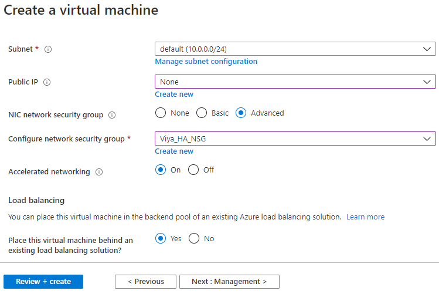

1. For **Load balancing options**, select **Azure load balancer**.
1. For **Select a load balancer**, select the TCP load balancer that you created
   previously.
1. Click **Next: Management >**. Advance through the remaining wizard pages
   (Advanced and Tags) and select the desired settings.

1. Click **Review + create**.
1. Read the Terms of Service and click **Create**.

Repeat these steps as many times as needed to configure the VM instances for
your HA PGPool cluster.

> **_NOTE:_** We will create a VM to act as the jump server host as a separate
> step.

### Configure VM Network Settings for Other Hosts (No PGPool)

Now create additional VM instances to host all the SAS Viya services and
infrastructure servers, as well as the CAS server, with the redundancy that you
want. Your storage and network settings differ slightly for the VM instances
that will not host PGPool (will not host the PostgreSQL components for SAS
Infrastructure Data Server).

1. Follow the steps described in
   [Create Virtual Machine Instances](#create-virtual-machine-instances).
1. Click the **Networking** tab near the top of the page.
1. Select the same settings for the **Virtual Network** and **Subnet** that you
   selected for the PGPool instances.
1. For **Public IP**, select **None**. Your VM instances that will not host
   PGPool (that is, hosts that are not deployTargets for the `[pgpool]` host
   group) do not require public IP addresses.
1. Use all the same settings that are described in
   [Configure VM Network Settings for PGPool VM Hosts](#configure-vm-network-settings-for-pgpool-vm-hosts).

### Add Load-Balancing Rules to the Load Balancer

Now create a load-balancing rule to associate the load balancer with the pool of
VM instances in your virtual network.

1. From the Azure Portal home page, click to select your load balancer if it
   appears in the list of **Recent resources**. Otherwise do a search for it.

   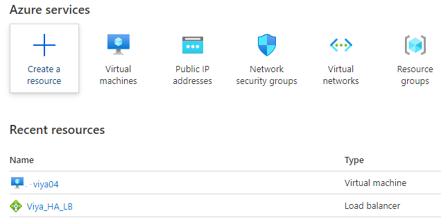

1. Under Settings, select **Load balancing rules**.
1. Click **+Add**.

   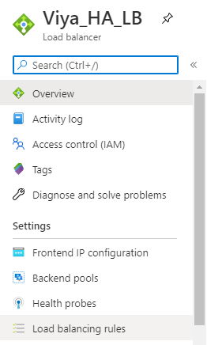

1. For HA PGPool, create three load-balancing rules, one for each of the three
   required HA PostgreSQL ports. For each rule, specify values for the following
   options and leave some default settings in place:

   - **Name**: A name to identify the rule
   - **Protocol**: TCP
   - **Port**: See below for specific information
   - **Backend port**: See below
   - **Backend pool**: Select the pool that you created for your PGPool VM
     instances in a previous step. This pool consists of the private IP
     addresses of the VM instances that will be included in the [pgpool] host
     group when you edit the Ansible playbook.
   - **Health probe**: Select the health probe that you created for your load
     balancer.
   - **Session Persistence**: None (the default)
   - **Idle timeout (minutes)**: (Increase the default setting if desired)
   - **Floating IP**: Disabled (the default)

1. For the **Port**, specify one of the following ports for each load-balancing
   rule:

   - 5431 to Backend port 5431
   - 5430 to Backend port 5430
   - 7 to Backend port 7

1. Click **OK** to save each load-balancing rule.

### Complete VM Setup

Log in to each VM as the admin user that you created and complete the
configuration of your VM instances.

1. Connect to each VM instance using SSH:

   ```ssh
      ssh user-name@<instance-public-ip>
   ```

   For `user-name`, substitute the admin user name that you provided when you
   created the VM instances.

1. If the FQDN of any instance is longer than 64 characters, the Ansible
   playbook does not support it. Shorten it:

   ```unix
   sudo hostnamectl set-hostname $(hostname -s).internal.cloudapp.net
   ```

1. Define hosts in the `/etc/hosts` file of each VM. Add an entry with each
   internal IP address, FQDN, and short host name.

   This step is required in order to avoid cluster failure when the VM is
   restarted, typically resulting in a change to the FQDN.

1. If iptables has policy chains, flush and disable it. Otherwise, it might
   block the traffic between PGPool instances.

   ```yaml
   # Check the chains
   sudo iptables -L
   # Flush all the chains
   sudo iptables -F
   # Verify that all the chains were flushed
   sudo iptables -L
   # Disable iptables on Red Hat Enterprise Linux 7
   sudo systemctl stop firewalld
   sudo systemctl disable firewalld
   ```

## Update Network Security Settings

The network security group that you created
[previously](#create-a-network-security-group) needs to be configured to allow
access to the public IP addresses that you created for your load balancer and
PGPool VM instances.

1. From the Azure Portal home page, click to select your network security group
   if it appears in the list of **Recent resources**. Otherwise do a search for
   it.
1. Under **Settings**, click **Inbound security rules**.
1. Click **+Add**.
1. In the Add inbound security rule dialog box, specify values for the following
   options:
   - **Source**: Select **IP Addresses**
   - **Source IP addresses/CIDR range**: Specify a comma-separated list of IP
     addresses. Include all the IP addresses of the PGPool VM instances and the
     public IP address that you created previously, in
     [Create a Public IP Address for the Load Balancer](#create-a-public-ip-address-for-the-load-balancer)
   - **Source port ranges**: \* (default)
   - **Destination**: Any (default)
   - **Destination port**: Specify the following comma-separated range of ports:
     `5431,5430,7`
   - **Protocol**: TCP (default)
   - **Action**: Allow (default)
   - **Priority**: Specify 100 or higher. Rules are processed in priority order.
     Lower numbers have higher priority.
   - **Name**: A name to identify the security rule
   - **Description**: (Optional)
1. Click **Add** to add the new inbound rule.

## Create a Jump Server

The jump server VM is an Ansible host. SAS Viya is deployed using an Ansible
playbook.

1. Following the steps described previously in
   [Create Virtual Machines](#create-virtual-machines), create a machine with
   the following specifications:

   - 4 vCPUs, 16 GB RAM
   - **Size**: "Standard_D4s_v3" Standard_B2s (for example)
   - **Image**: Red Hat Enterprise Linux 7.x (select the same operating system
     that you selected for your VM instances)
   - **Resource group**: Select a resource group or create a new one.

     SAS recommends selecting a different resource group from the one that you
     selected for your other VM instances. Using a separate group enables you to
     retain your playbook, mirror repository, and possibly your openLDAP server
     (if it is running on the jump server VM) in the event that you must run a
     fresh deployment and delete the deployment in the other resource group.

1. Configure the Administrator account and SSH key just as you did for the
   previous VM instances.
1. As you did for the VM instances, select **None** for **Public inbound
   ports**.
1. Click the **Disks** tab; create a disk and select **Disk Options** for a disk
   with minimal space.
1. For **Encryption type**, leave the default setting (Encryption at-rest with a
   platform-managed key).
1. Click the **Networking** tab near the top of the page.
1. For the **Virtual Network**, select the network that you created previously.
1. For the **Subnet**, select the subnet that you created previously.
1. For **Public IP**, select **Static**.

   Microsoft Azure automatically assigns a public IP address to the VM. Record
   this static public IP address.

1. Under **NIC network security group**, select **Advanced**.
1. In the **Configure network security group** field, select the network
   security group that you created previously.
1. For **Accelerated networking**, click **Off**.
1. Now click **Next: Management >**. Advance through the remaining wizard pages
   (Advanced and Tags) and select the desired settings.

1. Click **Review + create**.
1. Read the Terms of Service and click **Create**.

## Provision an Application Gateway

Set up an application gateway to act as the HTTPS load balancer for the SAS Viya
HTTP servers that are deployed on our three SAS Viya Services hosts.

### Create a Self-Signed Certificate for the Application Gateway

Generate and configure a self-signed certificate (.pfx) for the front end of the
application gateway.

> _**NOTE:**_ SAS recommends that you use your own custom certificates that
> comply with the security policies at your enterprise.

You can perform these steps on the jump server so that you can easily distribute
certificates.

1. First, generate a private key using OpenSSL:

   ```unix
   openssl ecparam -out key-name.key -name prime256v1 -genkey
   ```

1. When prompted, supply a password for the certificate.
1. Create the private key and certificate signing request for the application
   gateway:

   ```unix
   openssl req -new -sha256 -key private-key-name.key -out csr-name.csr

   openssl x509 -req -sha256 -days 365 -in csr-name.csr -signkey key-name.key -out certificate-name.crt
   ```

1. When prompted, specify a password for the root key and organizational
   information for the CA.
1. Use the CSR to generate the certificate and the key, and sign using with the
   CA root key:

   ```unix
   openssl x509 -req -in csr-name.csr -CA  certificate-name.crt -CAkey private-key-name.key -CAcreateserial -out certificate-name.crt -days 365 -sha256
   ```

1. Convert the certificate file to PFX format:

   ```unix
   openssl pkcs12 -export -out certificate-name.pfx -inkey private-key-name.key -in certificate-name.crt
   ```

1. When prompted, specify a password to protect your certificate.

### Create the Application Gateway

1. On the Azure portal home page, click **Create a Resource**. Do a search for
   "application gateway" and select it.

1. On the Application Gateway page, click **Create**.

1. On the Create application gateway page, specify values for the following
   settings:

   - **Subscription**: (Your subscription is populated)
   - **Resource group**: Select the resource group that you created previously
     if it is not populated.
   - **Application gateway name**: Specify a name to help you identify the
     application gateway.
   - **Region** (Your region is populated)
   - **Tier**: Specify **Standard V2** (or WAF v2 if you want to deploy a web
     application firewall. WAFs are not discussed in this example.)
   - **Enable autoscaling**: Yes (default)
   - **Minimum/Maximum scale units**: Use default settings
   - **Availability Zone**: None (default)
   - **HTTP2**: Disabled (default)

1. Under **Configure virtual network**, select the same virtual network that you
   created previously for the other resources in your HA SAS Viya deployment.

   It is recommended that you place the application gateway in its own subnet
   within the virtual network.

1. For the **Subnet**, click **Manage subnet configuration**. The Subnets page
   is displayed.

1. Click **+ Subnet** to create a new subnet for the gateway.

1. Specify a name for the new subnet to help you identify it.
1. Specify an IP address and subnet mask that falls within the virtual network
   in the **Address Range** field, such as `10.20.0.0/24`.
1. Click **Save**.

   You return to the Create application gateway page.

1. Click **Next: Frontends >**.
1. Set the **Frontend IP address type** to **Public**.

1. For **Public IP address**, click **Add new**.

1. In the Add a public IP dialog box, specify a **Name** for the public IP
   address.

1. Click **OK**. The new public IP address is created automatically.
1. Set it to **Static**.
1. Click **OK**.
1. Click **Next: Backends >**.
1. On the **Backends** tab, click **Add a backend pool**.
1. In the Add a backend pool dialog box, specify a **Name** for the pool to help
   you identify it.
1. Select **No** for **Add backend pool without targets** (the default).
1. Select **IP address or FQDN** for the Target Type. In the **Target** column,
   click to select the names of the VM instances that will be targets for the
   [httpproxy] host group.

   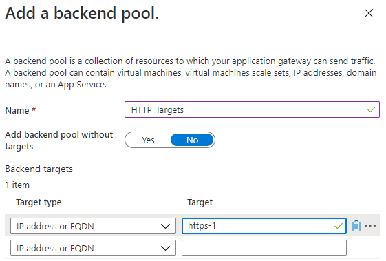

1. Click **Add** to add more VM instances to the backend pool. Then click
   **Next: Configuration >**.
1. On the **Configuration** tab, click **+Add a routing rule** under Routing
   rules.
1. In the Add a routing rule section, specify a **Rule name** for the routing
   rule.
1. Specify values for the following settings:

   - **Listener name**: Specify a name for the listener to help you identify it.
   - **Frontend IP**: Select **Public**, and then select the public IP address
     that you created for the front end of the application gateway.

     Leave the default settings for the remaining options.

1. Click the **Backend targets** tab.
1. For the **Target type**, select **Backend Pool** (the default).
1. For the **Backend target**, select the backend pool that you created
   previously for the application gateway.

1. For **HTTP settings**, click **Create new** to create an HTTP setting for the
   routing rule.

1. Specify a **Name** to help you identify the HTTP setting.
1. For the **Backend Protocol**, select **HTTP** (the default).
1. Keep the default for the **Backend port**.
1. Increase the value for **Request time-out (seconds)** to a minimum of `60` or
   even `120`.
1. Specify values for other settings or accept the default values and click
   **Add** to add the HTTP setting to the routing rule.
1. Leave the remaining settings at their defaults, and click **Add**.

   You return to the **Configuration** tab.

1. Click **Add** to save the routing rule.
1. Click **Next: Tags >**. Add tags if desired.
1. Click **Review + create**, review your settings, and then click **Create** to
   create the application gateway.

### Add a DNS Name

The application gateway needs a DNS name for the frontend public IP address. The
Azure portal does not provide this option through the user interface until the
gateway object has been created.

1. As soon as you see that the new gateway has been created on the Application
   Gateways page, click to expand **Deployment Details**. In the **Resource**
   list, click the name of the public IP address that you assigned to the
   gateway.

   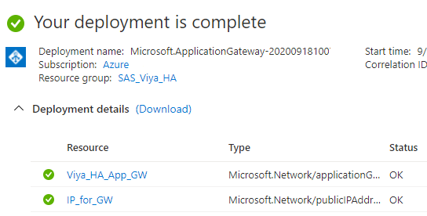

1. In the menu on the left, click **Configuration**.
1. Specify a label in the **DNS name label (optional)** field. For example,
   specify `my-company-fullha-viya`.
1. Click **Save**.

   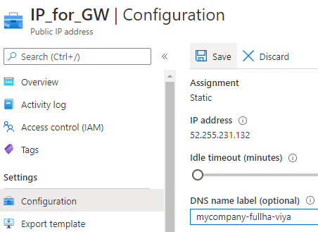

### Add the Certificate to the Application Gateway

Now you need to add the the frontend certificate (which Microsoft Azure
documentation refers to as SSL Termination) and the backend certificates for
end-to-end SSL. You can either create self-signed certificates or use another
method. SAS recommends using "well-known" certificates to secure both the
application gateway and the VM instances that host SAS Viya HTTP Servers.

You can also wait to supply some custom certificates after the deployment has
completed. Refer to the "Security" section of the _SAS Viya 3.5 Administration
Guide_ for information about replacing the default self-signed certificates on
SAS Viya HTTP servers with custom certificates.

1. On the previous page showing details about the application gateway, Azure
   portal home page, In the **Resource** list, click the name of the application
   gateway.
1. In the menu on the left, click **Configuration**.
1. Click the **Backend targets** tab.
1. For the **Target type**, select **Backend Pool** (the default).
1. For the **Backend target**, select the backend pool that you created
   previously for the application gateway.

1. Click **HTTP settings** in the left pane.
1. Click **+ Add** to create a new HTTP setting.
1. Specify a **Name** to help you identify the HTTP setting.
1. For the **Backend Protocol**, select **HTTPS**.
1. Specify **443** for the **Backend port**.
1. Specify values for other settings or accept the default values and click
   **Add** to add the HTTP setting to the application gateway.
1. For **Trusted Root Certificate**, leave the default setting for **Use well
   known CA certificate**.

1. For **Choose a certificate**, click **Create new**.
1. From the **CER certificate** field, browse to the location where you saved
   the CER file and select it.
1. Specify a **Name** for the certificate to help you identify it.
1. Click **Add Certificate**.

   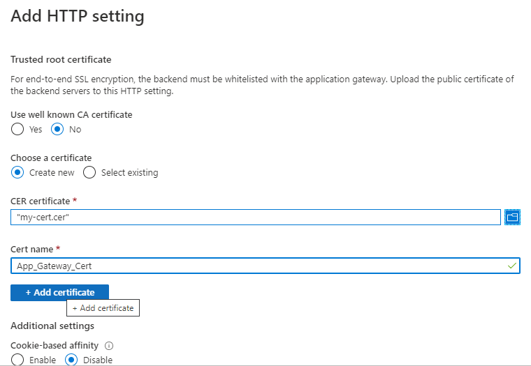

1. Click **Save**. Application gateway configuration is now complete.

## Set Up a Shared File System for HA SAS Viya

The VM instances in your HA deployment of SAS Viya require a shared file system
on a persistent storage volume.

SAS recommends that you use a volume that is HA-enabled. For example, the disks
where files are stored should not have a single point of failure.

1. Create a file share for the shared user's Home directory that is required for
   SAS Studio. On the Azure portal home page, click **Create a resource** and
   search for "storage account".
1. On the Storage Accounts page, click **+Add**. The Storage Account Creation
   page appears.
1. In the Basics section, select the desired **Performance** and the **Account
   Kind**.

   Your **Subscription** and **Region** are populated.

1. Select the **Resource Group** that you created previously if it is not
   populated.
1. Specify a **Storage account name** and select your preferred settings for
   **Replication** and **Access tier**.

1. If desired, set up **Networking** and **Advanced** options.
1. When you have selected options for all required settings, the **Create**
   button is enabled on the **Review + create** tab. Click **Create**.
1. Select the storage account that you have just created, and click **File
   shares**.
1. Click **+ File share** to create a new file share.
1. Specify a **Name** for the new file share.
1. For the **Quota**, specify a size that a SAS Studio user is likely to require
   in order to store configuration information, such as `10`.
1. Repeat the previous steps to create a second file share for the CAS Server
   machines.

   Provision it with a 100 GB quota.

Now obtain the storage account key for your new storage account. You will supply
it when you mount the storage volumes on VM instances.

1. Navigate to the storage account that you just created in the Azure portal.

1. Under **Settings**, select **Access keys**. A list of account access keys
   that have been configured is displayed.

1. Locate the Key value and click **Copy** to copy the account key. Keep this
   information available for later use.

### Mount the Azure File Shares on All VM Instances

Mount the file shares that you have just configured for the
[required shared Home directory](https://documentation.sas.com/?docsetId=dplyml0phy0lax&docsetTarget=n0iuh6029au7ton136yfzp33z9q3.htm&docsetVersion=3.5&locale=en#n1ic1yydp46vxun1bhhii6rnyg2x)
on all SAS Viya VM instances that will host the [ComputeServer] host group. Your
jump server host also needs this file share mount if you installed a default
OpenLDAP server there.

Mount the file shares that you have just configured for the CAS server as
described in
[Enable a Shared File System](https://go.documentation.sas.com/?cdcId=calcdc&cdcVersion=3.5&docsetId=dplyml0phy0lax&docsetTarget=n10k0xp8qud9mkn1l8mhl992ikyg.htm&locale=en#p1u5hdmssc4y87n1ltl5wl8ews6g).

Microsoft recommends using SMB 3.0 to mount an Azure file share on Linux because
it supports the encryption that Azure Files requires.

The cifs-utils Linux package is required. You must also make sure that port 445
is open for TCP traffic to enable SMB communications.

SAS recommends following the steps in this Microsoft document to create a folder
for the mount point, set permissions, and also configure a credential file, if
desired:
[Use Azure Files with Linux](https://docs.microsoft.com/en-us/azure/storage/files/storage-how-to-use-files-linux).

## Additional Setup for SAS Common Planning Service PostgreSQL

If your SAS Viya software order included products that use SAS Common Planning
Service, additional resources might be required. For orders that include SAS
Assortment Planning, SAS Demand Planning, SAS Financial Planning, or SAS
Markdown Optimization, the deployment must include SAS Common Planning Service
PostgreSQL (or "cpspostgres"). You have two options:

1. Deploy CPSPGPool without high availability (a single CPSPGPool instance).
1. Deploy HA CPSPGPool (clustered CPSPGPool instances).

If you select Option 1, you can install CPSPGPool on any host in your
deployment.

If you select Option 2, you must place CPSPGPool instances on _separate hosts_
from regular PGPool instances. Also, you must repeat the steps that you took to
create a load balancer, firewall rules, and health probe for the regular HA
PGPool.

The inventory.ini file must include the hosts of CPSPGPool instances. In the
vars.yml file, specify the following in the `INVOCATION_VARIABLES` section, just
as you would for the regular PGPool hosts:

```yaml
cpspgpoolc:
  - HA_PGPOOL_VIRTUAL_IP=
  ## Supply the value of the public IP address for the CPSPGPool load balancer
  - HA_PGPOOL_WATCHDOG_PORT=
## Supply the port value. It might be the same as for PGPool because they are on different hosts
```

## Prepare to Run the Ansible Playbook

Before you start preparing your deployment playbook, SAS recommends that you
read the appendix titled
[Creating High Availability PostgreSQL and PGPool Clusters](https://documentation.sas.com/?docsetId=dplyml0phy0lax&docsetVersion=3.5&docsetTarget=p0no3xztcdmanqn1cg9bkhajpdzc.htm&locale=en)
in the _SAS Viya 3.5: Deployment Guide_.

Follow the instructions in the
[SAS Viya Deployment Guide](https://documentation.sas.com/?docsetId=dplyml0phy0lax&docsetTarget=p06vsqpjpj2motn1qhi5t40u8xf4.htm&docsetVersion=3.5&locale=en)
for Linux in order to complete the following steps:

- Verify Linux
  [prerequisites](https://go.documentation.sas.com/?docsetId=dplyml0phy0lax&docsetTarget=n19vw6gi000spun1sq96qgvsaeef.htm&docsetVersion=3.5&locale=en)
  and perform required
  [pre-installation tasks](https://documentation.sas.com/?docsetId=dplyml0phy0lax&docsetTarget=p16gork369vpprn19tm1cind681o.htm&docsetVersion=3.5&locale=en)
- Download SAS Mirror Manager and
  [create a mirror repository](https://documentation.sas.com/?docsetId=dplyml0phy0lax&docsetTarget=p1ilrw734naazfn119i2rqik91r0.htm&docsetVersion=3.5&locale=en)
  on the jump server
- [Install Ansible](https://documentation.sas.com/?docsetId=dplyml0phy0lax&docsetTarget=p1puupgtsay2r5n1h6k11n6lpl97.htm&docsetVersion=3.5&locale=en)
  on the jump server
- Edit the
  [inventory file](https://go.documentation.sas.com/?docsetId=dplyml0phy0lax&docsetTarget=p049t0kjjzyyiqn1wb3m0u1uao02.htm&docsetVersion=3.5&locale=en)
  to reflect your hosts.
- In the vars.yml file,
  [described in detail here](https://documentation.sas.com/?docsetId=dplyml0phy0lax&docsetTarget=n1knvzbsifo9xqn1al0bh7wxrrkg.htm&docsetVersion=3.5&locale=en),
  define your PGPool cluster topology. Specify the static network IP address for
  the `HA_PGPOOL_VIRTUAL_IP` variable in vars.yml.

## Contributing

We welcome your contributions! Please read [CONTRIBUTING.md](CONTRIBUTING.md)
for details on how to submit contributions to this project.
